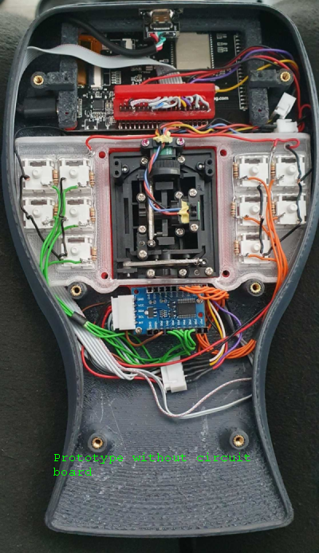
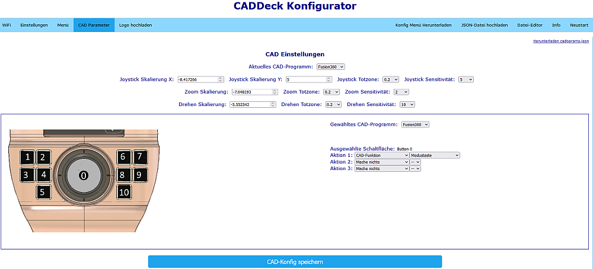

# CADDeck

This is a combined joystick and touch panel display suitable for use with common CAD programs. It includes:
1. Two axis joystick (e.g. for X, Y pan)
2. Thumbwheel encoder in the joystick grip (e.g. for zoom) with push switch (e.g. for select)
3. Four switches around joystick grip (e.g. hold one down while moving joystick for pan and another for rotate)
4. Four switches around the base (e.g. measure, ESC...)
5. LCD touch panel with up to 10 screens of 12 buttons

All H/W buttons as well as the touch panel buttons are programmable through a web page.

It connects to the PC via Bluetooth using the HID interface (i.e. it looks like a keyboard and mouse to the PC). A USB-C port is provided for power and to download code.
Location of the USB-C port on the left side is not ideal, but that is where it is on the screen being used.
It should be possble to run power to the unit and hardwire it to the screen rather than using the USB-C for power but I have not tried this.

## Touch Panel
The touch panel is adapted from Dustin Watt's FreeTouchDeck project (https://github.com/DustinWatts/FreeTouchDeck.git) which I modified to increase the button count,
etc.  (https://github.com/andrewfernie/FreeTouchDeckWT32.git). For this project I added support for the joystick, encoder, and buttons.
The easiest way to get it going is to use a WT32-SC01 board (http://www.wireless-tag.com/portfolio/wt32-sc01/).
Purchase the basic board, not the "Plus" version as the Plus uses a parallel interface to the LCD panel and doesn't leave enough IO lines free for the joystick and buttons,
etc. The board includes an ESP32 module, and a 3.5" LCD with capacitive touchscreen.

## S/W Build Notes:
1. The build uses the PlatformIO IDE for VSCode. Install VSCode, then the PlatformIO plugin and you should be good to go.  
2. You need to make sure that the appropriate pins are defined for your hardware configuration. I built mine for the WT32-SC01 and have built the code for a handwired ESP32 module + resistive touchscreen. 
3. You may see build messages like
        
        In file included from include/CADDeck.h:14,
                 from include/SaveConfig.h:3,
                 from src/SaveConfig.cpp:1:
        .pio/libdeps/esp-wrover-kit/TFT_eSPI/TFT_eSPI.h:909:8: warning: #warning >>>>------>> TOUCH_CS pin not defined, TFT_eSPI touch functions will not be available! [-Wcpp]
        #warning >>>>------>> TOUCH_CS pin not defined, TFT_eSPI touch functions will not be available!`
    
    You can get rid of these by defining TOUCH_CS in platformio.ini to any unused pin that is a valid output pin.
	The alternative is to not define TOUCH_CS (delete the line, or put a semi-colon in front of it) and just ignore the messages.

        #define TOUCH_CS=33

4. The system tries to display the logo in "CADDeck_logo.bmp" at startup. If you don't want anything displayed make sure that the file doesn't exist. In this case you will see a message like the following on the serial port.
   As long as you didn't weant anything displayed at startup ignore the message.
        
        [  1159][E][vfs_api.cpp:104] open(): /littlefs/logos/CADDeck_logo.bmp does not exist, no permits for creation

5. You may  see some error messages like 
   
        [vfs_api.cpp:104] open(): /littlefs/list does not exist 
        
   This is a known issue with ESPAsyncWebsServer related to LittleFS supporting folders while SPIFFS does not. See https://github.com/lorol/

6. Having trouble? There are some debug messages that can be enabled in FreeTouchDeck.h
   
        #define LOG_MSG_BASIC 1
        #define LOG_MSG_LEVEL 1  // 1=ERROR, 2=ERROR+WARN, 3=ERROR+WARN+INFO
        #define LOG_MSG_DEBUG 0
        #define LOG_MSG_TOUCH_DEBUG 0  // messages to console each time a touch is detected

   Try setting LOG_MSG_LEVEL to 3 and you will get quite a few more status messages

# Hardware Build

Most assembly is basic and is primarily wiring.  Complete 3D CAD models are provided in both Fusion360 and STEP formats in the hardware/model folder.

References to button numbers are as shown in this diagram:

## Case
A Fusion360 model of the case, as well as STL files, are included in the CADDeck repository. The main case is printed in four pieces.
The two top sections are bolted together internal to the case with M3 cap screws and nuts.
M3 threaded inserts are used in the top front piece (six places), then the bottom is attached to the top with M3 flat head screws. 

There is no obvious way to attach the screen to the case. So I designed the case so that the display is held with a frame.
First the display is pushed into the housing until it snaps into the rear spacers.
Then the TPU seal is pushed between the housing and the display and finally the two front spacers are inserted.
If necessary, the display can be pressed against the TPU seal from behind with two screws.
But wasn't necessary for me.

The USB-C adapter board is attached to the small base with two self-tapping screws.

6 x M3 pan head screws go through the bottom of the case and are used to hold the case closed.
4 x M3 pan head screws come through the bottom of the case and are used to attach both the joystick and the switch plate with the 10 switches.

## Joystick knob

The tricky part is the joystick button and in particular the magnets and hall sensors. The upper Hall sensor is glued in directly
and I soldered the lower one to a small perforated plate beforehand and then attached it with superglue.
We may try to create a circuit board layout for it, as well as for the MX buttons.

The joystick button consists of several 3D printed parts.
Inside the joystick button are several magnets that repel each other and keep it in a floating position. I used a little superglue to attach the magnets, you can just run a drop of superglue through the small hole in the plastic.
In the picture directory you will find a representation of how the magnets (N+S) are arranged.

When all magnets are mounted, the cross and the magnet holder are carefully put together and then twisted so that the magnets are on top of each other.
Then the three guide pins are inserted with some grease, they hold the two parts together.
An M4x16mm spacer made of brass is pressed into the base plate from above (fix with some glue if necessary).
Then insert the base plate with some grease from below into the cross and make sure that it runs smoothly.
The axis may need some editing, depending on how accurate your printer prints.
I screwed an M4 screw into the base plate, clamped it in a cordless screwdriver and sandpapered it until
until it fits.
The bottom plate with the magnets is attached with three self-tapping screws.
The touch sensor is attached to the lid with glue, the lid is pushed into the top of the wheel at the very end and should hold without glue.

The wires from the touch sensor and the top hall sensor are routed down through holes. Please leave the cables a bit longer as the joystick knob will be rotated onto the joystick later.

All 10 MX buttons are used on the switch console and wired according to the circuit diagram.
The PCF8575 is attached to the adapter plate with self-tapping screws.
First insert the joystick from below, then the adapter plate and then the switch console.
Insert the foam from above, then turn the joystick knob onto the joystick and guide the cables down under the foam.
The joystick button is attached to the joystick and countered from above with an M4 stud screw so that it sits firmly on the joystick axis.
Now the housing is assembled. First screw in all the screws loosely from below. Then tighten the six outer screws.
Now align the switch console so that the switch caps do not jam and finally tighten the last four screws.

In the Images directory there are a few more illustrations of how I printed the support.

## Wiring
A [wiring diagram](hardware/Electrical/WiringDiagram10Buttons.pdf) is included in the hardware/electrical folder. Most of it is straighjtforward.

## Parts List
Quantity 1 [ESP32-SC01 LCD Touch Screen] (https://www.aliexpress.com/item/1005004399769442.html)

Quantity 1 [2mm 2x20 Pin Header](https://www.aliexpress.com/item/1005001852671581.html)

Quantity 1 [TTP223 Capacitive Touch Switch](https://www.aliexpress.com/i/33012282190.html)

Lot of 10 [Cherry MX Button](https://www.ebay.de/itm/183967039197) (These come in different styles. With or without click, heavy or light resistance.)

Quantity 1 [FrSky M9 Joystick] (https://www.aliexpress.com/item/32829691785.html) This one is a bit expensive but it is a good quality device.
          Nothing fancy in terms of functionality - you just need something with analog X and Y outputs.

Quantity 1 [PCF8575 I2C IO Expander] (https://www.aliexpress.com/item/1005004433286881.html)

Quantity 1 [USB-C Adapter Board] (https://www.aliexpress.com/item/1005003446036071.html)

Quantity 2 [Hall Sensors 49E](https://www.aliexpress.com/item/1903819684.html)

Quantity 40 [Adhesive Balance Weights](https://www.ebay.de/itm/363221786745) (If necessary. The case was too light for me when I pulled the knob up.
           But you can also use something else to increase the weight.)

Lot of 10 10k 1/8W push-through resistors Cherry MX pushbutton

Quantity 6 M3 brass inserts (for the case top)

Quantity 3 M2 brass inserts (for the joystick button to attach the wheel)

Quantity 3 sheet metal screw 2.2x5mm (for magnet holder below)

Quantity 11 neodymium magnets N52 5x5x1mm (9 pieces for the rotary movement and two pieces on top of each other for the hall sensor)

Quantity 6 neodymium magnet N52 8x1mm (in the joystick button above and below)

Quantity 3 neodymium magnet N52 8x3mm (inside the joystick button in the middle)

Quantity 10 screws M3x16mm (for the housing and for attaching the joystick)

Quantity 9 screws M2x5mm (to fix the wheel on the joystick button, the USB-C board and fix the PCF8575)

JST RM 2.54mm connector 5-pin.

JST RM 2.54mm connector 2-pin.

Dupont connector RM 2.54mm

Some soft foam (between joystick button and joystick)

26 AWG silicone wire (0.14mm²) (preferably in several colors to avoid confusion)

# Setup
Once the unit is assembled and the display is coming up you should see the main page.

Go to the CAD Settings page.

Then the Switch Monitor page.

It displays the status of the joystick, encoder, and buttons. You should be able to see the result of each joystick movement or button selection.
Note that the values are shown as 1 when not selected and 0 when selected (pushed).

The joystick X and Y data may be bouncing around a bit. This is normal as the joystick is not calibrated at this point. To calibrate the joystick:
1. Go back to the CAD Settings page
2. Press the Joystick Zero button when the joystick is centered and still. This sets the zero point for the joystick. 
3. Press the Joystick Scale button and move the joystick around to the extremes in X and Y. You have 5s.
   Once the function finishes the calibration parameters will be calculated and the joystick should show a range of roughly +/- 1 in both X and Y. 
4. If you are happy with the calibration, press the Save CAD Configuration button and the parameters will be saved to the cadparams.json file in the ESP32.
   This file can be downloaded from the ESP32 to your PC via the CAD Settings page in the configurator.
   It is a good idea to do this and to copy the file to the data\config folder in the CADDeck code so that you won't lose the parameters next time you upload the data folder to the ESP32.
4. If you are not happy with the results, try again.

Bind your computer to the CADDeck using the Bluetooth setings page on your computer.

# Configuration
Note that all of the pages shown or mentioned above are samples. Every page can be reorganized and customized to suit your needs via the configurator.

## WiFi Configuration
The configurator is accessed via a web browser on a computer or tablet connected to the same network as the ESP32.
To enable the configurator go to the settings page on the touch panel and select the WiFi Enable button.  

If you have already configured your wifi connection in wificonfig.json you should see a message saying that it has connected to the wifi and will display the IP address.
At that point you can go to your browser and enter the IP address top connect. The configurator will be displayed.

If you have not already configured the wifi you should see a message saying that an access point (AP) has been created with a network name and IP address.
You will need to connect your computer to the network provided, and then point your browser at the IP address.
Once the configurator screen is displayed in your browser go to the wifi page and enter your network SSID and password. Then select "Save WiFi Config" to save the settings. 

## Menu Configuration
The main change from the original FreeTouchDeck is to allow more buttons per page  - the screen area is just a bit smaller than the size of twelve StreamDeck buttons which seems reasonable.
The code is currently set to three rows of four buttons, but can be changed to three rows of five buttons (or two rows of four, etc.) by modifying CADDeck.h: "#define BUTTON_ROWS 3" and "#define BUTTON_COLS 5".
In principle it should support larger arrays, but not tested, and the configurator page is set to a maximum of 3x5. 

The configurator displays an array of three rows of five buttons, with a drop down list to select the menu page to be modified.
If you are using fewer than 3x5, simply ignore the extra rows and columns. On the to-do list is to generate the HTML dynamically to correspond with the number of rows and columns.

Each Menu page has a 2D array of programmable buttons, and each button has an array of 3 actions that can be defined for when the button is pressed.

You can set different background colors for a button that performs an action (black background in the image above), or links to another menu (light blue in the image.)
This is controlled on the Settings page of the configurator.

If you don't want to use all buttons use the configurator to set the logo to "blank.bmp" and make sure that there are no actions defined for that button.
Any button with those characteristics will not be drawn.

One limitation is the size of the FLASH used for the configuration files and icons displayed on the touch screen. The icons are 75x75 24-bit color BMP files,
each one taking about 17kB. If you run out of space your only option is to check to see if any are unused and delete them.

## Hardware Buttons
Configuration of the hardware buttons is via a dedicated page within the same web-based configurator as for the LCD panel. 

The top section includes:
1. Current CAD program: This is the program whose settings will be loaded when the CADDeck is restarted
2. X and Y scaling parameters for the joystick. These can be set manually, but a function is provided to capture data as the joystick is moved to its extremes and calculate the scalings for you. The output scaling is +/-1
3. Joystick deadzone. Any X or Y value with an absolute value below this number is set to zero.
4. Joystick sensitivity. Joystick values are multiplied by this as they are converted to mouse movement commands
5. Thumbwheel sensitivity. The encoder value is multiplied by this as it is converted to mouse movement commands
6. Steady Time: After the joystick has been centered for more than this amount of time, without a pan or rotate button selection, the joystick will return to its default mode (typically mouse pointer)

Below that is the button action definition. The same approach to defining the actions is used as for the LCD panel buttons. The actions are:
1. Selected CAD program. The program whose settings are being modifed in that part of the configurator. Separate definitions of these settings are kept for each of the five CAD programs available.
2. Selected Button. One of the nine buttons shown in the image to the left. Click  one of the indicated areas in the image then modify the actions for that button as needed.
3. The actions that must be taken to enable pan/rotate/zoom to be controlled by the joystick (i.e. the mouse) within the selected CAD program.
   Note that the definition of what is needed to control pan/rotate/zoom is separate from which button enables that mode.
   As an example, Solidworks needs the middle mouse button to be held down to rotate the view. So, JoystickRotate/Action1 is set to "Mouse Buttons" and Value1 is set to "Press Middle Button".
   To assign the Rotate function to button 8, click "8" in the image to the left, then set SelectedButton/Action1 to "CAD Functions" and Value1 to "Joystick Rotate"

At the very bottom is the "Save CAD Config" button. When selected the settings for all CAD programs are saved on the ESP32 in file cadparams.json

## Default Configuration
While everything can be changed via the configurator, there are some default settings provided with the code.
These are:

### Control assignments
1. Joystick moves the mouse pointer
2. Joystick with Button 5 held down pans the view
3. Joystick with Button 6 held down rotates the view
4. The encoder zooms in and out
5. The encoder Button 9 is the same as the left mouse button (select)
6. Button 1 is measure ("i" in Fusion360) (I assigned "i" as a keyboard shortcut to measure in Solidworks)
7. Button 2 sets the zoom to fit ("F6" in Fusion360), ("f" in Solidworks)
8. Button 3 unselects ("ESC" in Fusion360 and Solidworks)
9. Button 4 toggles object visibility ("v" in Fusion360) or hides object ("TAB" in Solidworks)

### Menus
Menu numbers are assigned as follows:
1. Menu 0: Main menu
2. Menu 1: System Settings
3. Menu 2: CAD Settings
4. Menu 3: Not used
5. Menu 4: Not used
6. Menu 5: Not used
7. Menu 6: Not used
8. Menu 7: Select active CAD program
9. Menu 8: Fusion360 actions
10. Menu 9: Not used
 

