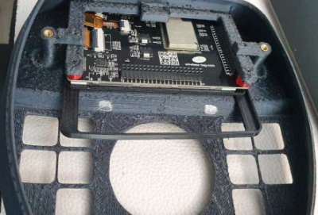
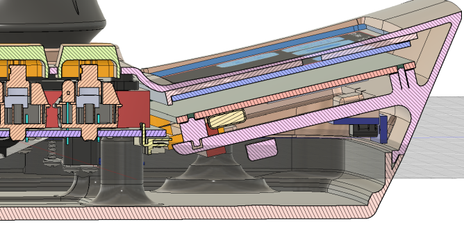
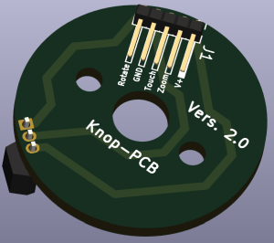
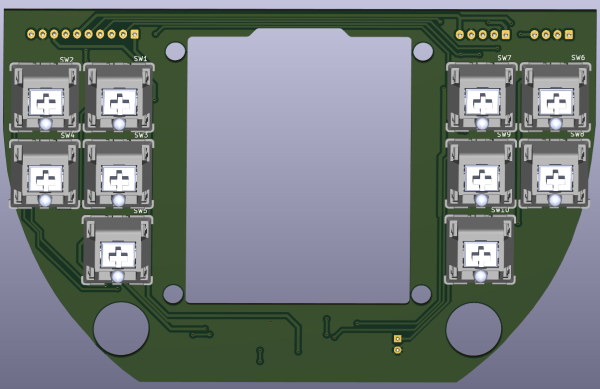
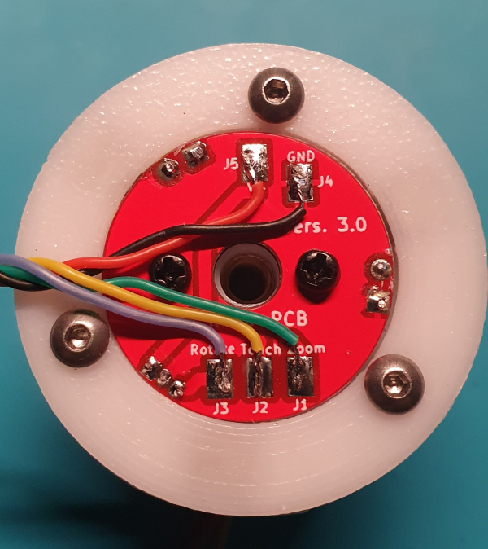
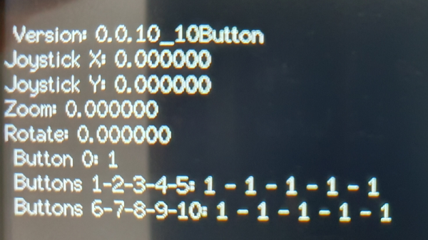

# CADdeck

The english[Anleitung](/READMEeng.md) Manual

Hierbei handelt es sich um ein kombiniertes Joystick- und Touchpanel-Display, das für die Verwendung mit gängigen CAD-Programmen geeignet ist. Es beinhaltet:
1. Zwei-Achsen-Joystick (z. B. für X-, Y-Schwenk)
2. Hall-Sensoren im Joystick-Griff (z. B. für Zoom und Drehung) mit einem berührungslosen Sensor (z. B. zum Bewegen der Komponente in Kombination mit dem Joystick)
3. Zehn Schalter rund um die Basis (z. B. Messen, ESC...)
4. LCD-Touchpanel mit bis zu 10 Bildschirmen und 12 Tasten

Alle H/W-Tasten und die Touchpanel-Tasten sind über eine Website programmierbar.

Die Verbindung zum PC erfolgt per Bluetooth über die HID-Schnittstelle (d. h. für den PC sieht es aus wie eine Tastatur und eine Maus).
Für die Stromversorgung und das Herunterladen von Code steht ein USB-C-Anschluss zur Verfügung.
Der USB-C-Anschluss auf der Rückseite dient der Stromversorgung zum Hochladen des Codes.
Es sollte möglich sein, das Gerät mit Strom zu versorgen und es fest mit dem Bildschirm zu verbinden, anstatt es über USB-C mit Strom zu versorgen, aber das habe ich noch nicht versucht.

## Touch-Panel
Das Touchpanel ist von Dustin Watts FreeTouchDeck-Projekt (https://github.com/DustinWatts/FreeTouchDeck.git) inspiriert, das ich modifiziert habe, um die Anzahl der Tasten zu erhöhen.
usw. (https://github.com/andrewfernie/FreeTouchDeckWT32.git). Für dieses Projekt habe ich Joystick-, Hallsensor- und Tastenunterstützung hinzugefügt.
Der einfachste Weg, dies in Gang zu bringen, ist die Verwendung einer WT32-SC01-Karte (http://www.wireless-tag.com/portfolio/wt32-sc01/).
Kaufen Sie das Basisboard, nicht die „Plus“-Version, da das Plus eine parallele Schnittstelle zum LCD-Panel nutzt und nicht genügend IO-Leitungen für den Joystick und die Tasten frei lässt.
usw. Das Board enthält ein ESP32-Modul und ein 3,5-Zoll-LCD mit kapazitivem Touchscreen.

## S/W-Aufbau-Hinweise:
1. Der Build verwendet die PlatformIO-IDE für VSCode. Installieren Sie VSCode, dann das PlatformIO-Plugin und schon kann es losgehen.
2. Sie müssen sicherstellen, dass die entsprechenden Pins für Ihre Hardwarekonfiguration definiert sind. Ich habe meines für den WT32-SC01 gebaut und den Code für ein handverdrahtetes ESP32-Modul + einen resistiven Touchscreen erstellt.
3. Möglicherweise sehen Sie Build-Meldungen wie
 
In der Datei, die aus include/CADDeck.h:14 enthalten ist,
aus include/SaveConfig.h:3,
von src/SaveConfig.cpp:1:
.pio/libdeps/esp-wrover-kit/TFT_eSPI/TFT_eSPI.h:909:8: Warnung: #warning >>>>------>> TOUCH_CS-Pin nicht definiert, TFT_eSPI-Touchfunktionen sind nicht zugänglich! [-Wcpp]
#Warnung >>>>------>> TOUCH_CS-Pin nicht definiert, TFT_eSPI-Touchfunktionen sind nicht verfügbar!`
 
Sie können diese beseitigen, indem Sie TOUCH_CS in platformio.ini für jeden nicht verwendeten Pin definieren, der ein gültiger Ausgabepin ist.
Die Alternative besteht darin, TOUCH_CS nicht zu definieren (die Zeile löschen oder ein Semikolon davor einfügen) und die Meldungen einfach zu ignorieren.

#define TOUCH_CS=33

4. Das System versucht beim Start, das Logo in CADDeck_logo.bmp anzuzeigen. Wenn Sie nicht möchten, dass etwas angezeigt wird, stellen Sie sicher, dass die Datei nicht existiert. In diesem Fall wird auf der seriellen Schnittstelle eine Meldung wie die folgende angezeigt.
Solange Sie beim Start nichts gesehen haben, ignorieren Sie die Meldung.
 
[ 1159][E][vfs_api.cpp:104] open(): /littlefs/logos/CADDeck_logo.bmp existiert nicht, keine Berechtigungen zum Erstellen

5. Möglicherweise werden Ihnen Fehlermeldungen wie z. B. angezeigt
 
[vfs_api.cpp:104] open(): /littlefs/list existiert nicht
 
Dies ist ein bekanntes Problem mit ESPAsyncWebsServer im Zusammenhang mit von LittleFS unterstützten Ordnern, während dies bei SPIFFS nicht der Fall ist. Siehe https://github.com/lorol/

6. Haben Sie Probleme? Es gibt einige Debug-Meldungen, die in FreeTouchDeck.h aktiviert werden können
 
#define LOG_MSG_BASIC 1
#define LOG_MSG_LEVEL 1 // 1=FEHLER, 2=FEHLER+WARN, 3=FEHLER+WARN+INFO
#define LOG_MSG_DEBUG 0
#define LOG_MSG_TOUCH_DEBUG 0 // Meldungen an die Konsole jedes Mal, wenn eine Berührung erkannt wird

Versuchen Sie, LOG_MSG_LEVEL auf 3 zu setzen, und Sie erhalten weitere Statusmeldungen

# Hardware-Aufbau

Der größte Teil der Montage ist einfach und besteht größtenteils aus der Verkabelung.
Vollständige 3D-CAD-Modelle werden sowohl im Fusion360- als auch im STEP-Format im Ordner „hardware/model“ bereitgestellt.

Die Verweise auf Tastennummern werden in diesem Diagramm angezeigt:

## Gehäuse
Ein Fusion360-Modell des Falls und STL-Dateien sind im CADDeck-Repository enthalten. Das Hauptgehäuse ist zweiteilig bedruckt.
Das Ober- und Unterteil wird von unten mit M3-Kopfschrauben verschraubt.

Es gibt keine offensichtliche Möglichkeit, den Bildschirm am Gehäuse zu befestigen. Deshalb habe ich das Gehäuse so entworfen, dass es das Display mit einem Rahmen hält.
Zuerst wird das Display in das Gehäuse geschoben, bis es in den hinteren Abstandshaltern einrastet.
Anschließend wird die TPU-Dichtung zwischen Gehäuse und Display geschoben und abschließend die beiden vorderen Abstandshalter eingefügt.
Bei Bedarf kann das Display mit zwei Schrauben von hinten gegen die TPU-Dichtung gedrückt werden.
Aber war bei mir nicht nötig.

Die USB-C-Adapterplatine wird mit zwei selbstschneidenden Schrauben an der kleinen Basis befestigt.

6 x M3-Flachkopfschrauben gehen durch die Unterseite des Gehäuses und dienen dazu, das Gehäuse geschlossen zu halten.
4 x M3-Flachkopfschrauben kommen durch die Unterseite des Gehäuses und dienen zur Befestigung sowohl des Joysticks als auch der Schalterplatte mit den 10 Schaltern.

## Joystick-Knopf

Der knifflige Teil ist die Joystick-Taste und insbesondere die Magnete und Hall-Sensoren. Der obere Hallsensor wird direkt eingeklebt
und das untere habe ich vorher auf eine kleine Lochmusterplatine gelötet und dann mit Sekundenkleber befestigt.
Für die Erstellung steht auch ein Platinenlayout zur Verfügung.
Platinen für die 10 Schalter und für den Taster habe ich bereits anfertigen lassen, dadurch ist der Aufbau übersichtlicher und die Verkabelung der MX-Taster entfällt.

 

 

Der Joystick-Knopf besteht aus mehreren 3D-gedruckten Teilen.
Im Inneren des Joystick-Knopfes befinden sich mehrere Magnete, die sich gegenseitig abstoßen und ihn so in einer schwebenden Position halten. Ich habe etwas Sekundenkleber verwendet
um die Magnete anzubringen. Sie können einfach einen Tropfen Sekundenkleber durch das kleine Loch im Kunststoff tropfen lassen.
Im Bildverzeichnis finden Sie eine Darstellung der Anordnung der Magnete (N+S).

Wenn alle Magnete montiert sind, werden das Kreuz und der Magnethalter vorsichtig zusammengesteckt und dann gedreht, sodass die Magnete übereinander liegen.
Anschließend werden die drei Führungsstifte mit etwas Fett eingesetzt, sie halten die beiden Teile zusammen.
Ein M4x16mm Abstandshalter aus Messing wird von oben in die Grundplatte eingedrückt (ggf. mit etwas Kleber fixieren).
Anschließend die Grundplatte mit etwas Fett von unten in das Kreuz einsetzen und auf Leichtgängigkeit achten.
Abhängig davon, wie genau Ihr Drucker druckt, muss die Achse möglicherweise bearbeitet werden.
Ich habe eine M4-Schraube in die Grundplatte geschraubt, diese in einen Akkuschrauber eingespannt und abgeschliffen, bis sie passte.
Die Bodenplatte mit den Magneten wird mit drei selbstschneidenden Schrauben befestigt.
Der Touchsensor wird mit Kleber am Deckel befestigt, der Deckel wird ganz am Ende in das Rad geschoben und sollte ohne Kleber halten.

Die Drähte vom Berührungssensor und vom oberen Hallsensor werden durch Löcher nach unten geführt.
Bitte lassen Sie die Kabel etwas länger, da der Joystick-Knopf später auf den Joystick aufgedreht wird.

Alle 10 MX-Taster werden am Schaltpult genutzt und entsprechend dem Schaltplan verdrahtet.
Der PCF8575 wird mit selbstschneidenden Schrauben an der Adapterplatte befestigt.
Zuerst den Joystick von unten einsetzen, dann die Adapterplatte und dann die Schalterkonsole.
Setzen Sie den Schaumstoff von oben ein, drehen Sie dann den Joystick-Knopf auf den Joystick und verlegen Sie die Kabel nach unten unter den Schaumstoff.
Der Joystick-Knopf wird am Joystick befestigt und von oben mit einer M4-Stiftschraube gekontert, sodass er fest auf der Joystick-Achse sitzt.
Jetzt ist das Gehäuse zusammengebaut. Schrauben Sie zunächst alle Schrauben von unten locker ein. Ziehen Sie dann die sechs äußeren Schrauben fest.
Richten Sie nun die Schalterkonsole so aus, dass die Schalterkappen nicht verklemmen und ziehen Sie abschließend die letzten vier Schrauben fest.

Im Bilderverzeichnis gibt es noch ein paar Bilder, wie ich die Stütze ausgedruckt habe.

## Verkabelung
Ein [Schaltplan](hardware/Electrical/WiringDiagram10Buttons.pdf) ist im Ordner hardware/electrical enthalten. Das meiste davon ist unkompliziert.

## Teileliste
Menge  1 [ESP32-SC01 LCD-Touchscreen] (https://www.aliexpress.com/item/1005004399769442.html)

Menge  1 [2mm 2x20 Pin Header](https://www.aliexpress.com/item/1005001852671581.html)

Menge  1 [Kapazitiver Berührungsschalter TTP223](https://www.aliexpress.com/i/33012282190.html)

Menge 10 [Cherry MX Button](https://www.ebay.de/itm/183967039197) (Diese gibt es in verschiedenen Ausführungen. Mit oder ohne Klick, starker oder leichter Widerstand.)

Menge  1 [FrSky M9 Joystick] (https://www.ebay.de/itm/374032459911) Dieses Gerät ist etwas teuer, aber von guter Qualität.
         Funktionell gibt es nichts Besonderes – man braucht nur etwas mit analogen X- und Y-Ausgängen.

Menge  1 [PCF8575 I2C IO Expander] (https://www.aliexpress.com/item/1005004433286881.html)

Menge  1 [USB-C-Adapterplatine] (https://www.aliexpress.com/item/1005003446036071.html)

Menge  2 [Hallsensoren 49E](https://www.aliexpress.com/item/1903819684.html)

Menge 40 [Klebe-Ausgleichsgewichte](https://www.ebay.de/itm/363221786745) (Bei Bedarf. Als ich den Knopf hochzog, war das Gehäuse zu leicht für mich.
         Sie können aber auch etwas anderes verwenden, um das Gewicht zu erhöhen.)

Menge 10 10k 1/8W Push-Through-Widerstände Cherry MX-Druckknopf

Menge  6 M3-Messingeinsätze (für Gehäuseoberseite)

Menge  3 M2-Messingeinsätze (für den Joystick-Knopf zum Befestigen des Rads)

Menge  3 selbstschneidende Schrauben 2,2x5mm (für Magnethalter unten)

Menge 11 Neodym-Magnete N52 5x5x1mm (9 Stück für die Drehbewegung und zwei Stück übereinander für den Hallsensor)

Menge  6 Neodym-Magnet N52 8x1mm (in der Joystick-Taste oben und unten)

Menge  3 Neodym-Magnet N52 8x3mm (im Joystick-Knopf in der Mitte)

Menge  6 Schrauben M3x10mm (für das Gehäuse)

Menge  4 Schrauben M3x20mm (zur Befestigung des Joysticks)

Menge  9 Schrauben M2x5mm (zur Befestigung des Rads an der Joystick-Taste, der USB-C-Platine und zur Befestigung des PCF8575)

Menge  1 M4x16mm Sechskant-Abstandsbolzen 

Menge  1 JST RM 2,54 mm Stecker und Stiftleiste  5-polig

Menge  1 JST RM 2,54 mm Stecker und Stiftleiste  4-polig

Menge  1 JST RM 2,54 mm Stecker und Stiftleiste 10-polig

Leicht weicher Schaumstoff (zwischen Joystick-Taste und Joystick)

26 AWG (0,14 mm²) Silikondraht für die Verbindung zwischen den Platinen(vorzugsweise in mehreren Farben, um Verwechslungen zu vermeiden)

30 AWG (0,05 mm²) Silikondraht für den Knopf(vorzugsweise in mehreren Farben, um Verwechslungen zu vermeiden)

# Aufstellen
Sobald das Gerät zusammengebaut ist und das Display erscheint, sollten Sie die Hauptseite sehen.

Gehen Sie zur Seite CAD-Einstellungen.

Dann die Seite Switch Monitor.

Es zeigt den Status des Joysticks, des Push-Sensors und der Tasten an. Sie sollten das Ergebnis jeder Joystick-Bewegung oder Tastenauswahl sehen können.
Beachten Sie, dass die Werte als 1 angezeigt werden, wenn sie nicht ausgewählt sind, und als 0, wenn sie ausgewählt (gedrückt) sind.

Die X- und Y-Daten des Joysticks sowie die Dreh- und Zoomdaten können leicht schwanken. Das ist normal, da der Joystick zu diesem Zeitpunkt noch nicht kalibriert ist.
So kalibrieren Sie den Joystick und den Knopf:
1. Gehen Sie zurück zur Seite CAD-Einstellungen
2. Drücken Sie die Joystick-Nulltaste, wenn der Joystick zentriert und stationär ist. Dadurch wird der Nullpunkt für Joystick und Knopf festgelegt.
3. Drücken Sie die Joystick-Skalentaste und bewegen Sie den Joystick zum äußersten X- und Y-Punkt, drehen Sie den Knopf und drücken Sie ihn nach oben und unten.
   Du hast 5 Sekunden Zeit.
   Sobald die Funktion abgeschlossen ist, werden die Kalibrierungsparameter berechnet und alle Achsen sollten einen Bereich von ungefähr +/- 1 sowohl in X als auch in Y anzeigen.
4. Wenn Sie mit der Kalibrierung zufrieden sind, klicken Sie auf die Schaltfläche „CAD-Konfiguration speichern“ und die Parameter werden in der Datei cadparams.json im ESP32 gespeichert.
   Diese Datei kann vom ESP32 über die Seite CAD-Einstellungen im Konfigurator auf Ihren PC heruntergeladen werden.
   Es empfiehlt sich, dies zu tun und die Datei in den Ordner data\config im CADDeck-Code zu kopieren, damit Sie die Parameter nicht verlieren, wenn Sie den Datenordner das nächste Mal auf den ESP32 hochladen.
4. Wenn Sie mit den Ergebnissen nicht zufrieden sind, versuchen Sie es erneut.

Verbinden Sie Ihren Computer über die Bluetooth-Einstellungsseite Ihres Computers mit CADDeck.

# Konstruktion
Bitte beachten Sie, dass es sich bei allen oben gezeigten oder erwähnten Seiten um Beispiele handelt. Jede Seite kann über den Konfigurator neu organisiert und an Ihre Bedürfnisse angepasst werden.

## WLAN-Konfiguration
Der Zugriff auf den Konfigurator erfolgt über einen Webbrowser auf einem Computer oder Tablet, der mit demselben Netzwerk wie der ESP32 verbunden ist.
Um den Konfigurator zu aktivieren, gehen Sie auf die Einstellungsseite des Touchpanels und wählen Sie die Schaltfläche „WLAN aktivieren“.

Wenn Sie Ihre WLAN-Verbindung bereits in wificonfig.json konfiguriert haben, sollte eine Meldung angezeigt werden, dass das WLAN verbunden ist und die IP-Adresse angezeigt wird.
An dieser Stelle können Sie zu Ihrem Browser gehen und die IP-Adresse von top connect eingeben. Der Konfigurator wird angezeigt.

Wenn Sie das WLAN noch nicht konfiguriert haben, sollte eine Meldung angezeigt werden, dass ein Zugangspunkt (AP) mit einem Netzwerknamen und einer IP-Adresse erstellt wurde.
Sie müssen Ihren Computer mit dem bereitgestellten Netzwerk verbinden und dann Ihren Browser auf die IP-Adresse verweisen.
Sobald der Konfiguratorbildschirm in Ihrem Browser erscheint, gehen Sie zur WLAN-Seite und geben Sie Ihre Netzwerk-SSID und Ihr Passwort ein. Wählen Sie dann „Save WiFi Config“, um die Einstellungen zu speichern.

## Menükonfiguration
Die wichtigste Änderung gegenüber dem ursprünglichen FreeTouchDeck besteht darin, dass mehr Tasten pro Seite möglich sind – die Bildschirmfläche ist nur geringfügig kleiner als die Größe von zwölf StreamDeck-Tasten, was vernünftig erscheint.
Der Code ist derzeit auf drei Reihen mit je vier Schaltflächen eingestellt, kann jedoch durch Ändern von CADDeck.h in drei Reihen mit je fünf Schaltflächen (oder zwei Reihen mit je vier Schaltflächen usw.) geändert werden: „#define BUTTON_ROWS 3“ und „#define BUTTON_COLS 5“. „. ".
Grundsätzlich sollte es größere Arrays unterstützen, wurde aber nicht getestet und die Konfiguratorseite ist auf maximal 3x5 eingestellt.

Der Konfigurator zeigt eine Reihe von drei Reihen mit fünf Schaltflächen an, mit einer Dropdown-Liste zur Auswahl der zu ändernden Menüseite.
Wenn Sie weniger als 3x5 verwenden, ignorieren Sie einfach die zusätzlichen Zeilen und Spalten. Auf der To-Do-Liste steht die dynamische Generierung des HTML-Codes, um ihn an die Anzahl der Zeilen und Spalten anzupassen.

Jede Menüseite verfügt über eine 2D-Reihe programmierbarer Tasten und jede Taste verfügt über eine Reihe von 3 Aktionen, die beim Drücken der Taste definiert werden können.

Sie können unterschiedliche Hintergrundfarben für eine Schaltfläche festlegen, die eine Aktion ausführt (schwarzer Hintergrund im Bild oben) oder für Links zu einem anderen Menü (hellblau im Bild).
Dies wird auf der Seite „Einstellungen“ des Konfigurators gesteuert.

Wenn Sie nicht alle Buttons nutzen möchten, stellen Sie im Konfigurator das Logo auf „blank.bmp“ ein und achten Sie darauf, dass für diesen Button keine Aktionen definiert sind.
Schaltflächen mit diesen Eigenschaften werden nicht gezeichnet.

Eine Einschränkung ist die Größe des FLASH, der für die auf dem Touchscreen angezeigten Konfigurationsdateien und Symbole verwendet wird. Bei den Symbolen handelt es sich um 75x75 24-Bit-Farb-BMP-Dateien.
Jeder benötigt etwa 17 KB. Wenn Ihnen der Speicherplatz ausgeht, besteht Ihre einzige Möglichkeit darin, zu prüfen, ob noch freier Speicherplatz vorhanden ist, und ihn zu löschen.

## Hardwareschlüssel
Die Hardwaretasten werden über eine spezielle Seite innerhalb desselben webbasierten Konfigurators wie für das LCD-Panel konfiguriert.

Der obere Abschnitt umfasst:
1. Aktuelles CAD-Programm: Dies ist das Programm, dessen Einstellungen geladen werden, wenn CADDeck neu gestartet wird
2. X- und Y-Skalierungsparameter für Joystick und Knopf. Diese können manuell eingestellt werden
   Es gibt jedoch eine Funktion, die Daten sammelt, während der Joystick ganz nach unten gedrückt wird, und den Maßstab für Sie berechnet. Die Ausgabeskalierung beträgt +/-1
3. Deadzone von Joystick und Knopf. Jeder X- oder Y-Wert mit einem absoluten Wert unter dieser Zahl wird auf Null gesetzt.
4. Joystick-Empfindlichkeit. Joystick-Werte werden bei der Umwandlung in Mausbewegungsbefehle damit multipliziert
5. Empfindlichkeit des Knopfes. Der Knob-Wert wird damit multipliziert und in Mausbewegungsbefehle umgewandelt
6. Steady Time: Nachdem der Joystick länger als diese Zeitspanne zentriert war, ohne dass eine Schwenk- oder Drehtaste ausgewählt wurde, kehrt der Joystick in seinen Standardmodus (normalerweise Mauszeiger) zurück.

Darunter befindet sich die Definition der Tastenaktion. Zur Definition der Aktionen wird derselbe Ansatz wie für die Tasten auf dem LCD-Panel verwendet. Die Aktionen sind:
1. Ausgewähltes CAD-Programm. Das Programm, dessen Einstellungen in diesem Teil des Konfigurators geändert werden. Für jedes der fünf verfügbaren CAD-Programme werden separate Definitionen dieser Einstellungen gepflegt.
2. Ausgewählte Schaltfläche. Eine der neun im Bild links gezeigten Schaltflächen. Klicken Sie auf einen der angegebenen Bereiche im Bild und ändern Sie dann die Aktionen für diese Schaltfläche nach Bedarf.
3. Die Aktionen, die ausgeführt werden müssen, damit der Joystick (z. B. die Maus) das Schwenken/Drehen/Zoomen im ausgewählten CAD-Programm steuern kann.
Beachten Sie, dass die Definition dessen, was zum Steuern von Schwenken/Drehen/Zoomen erforderlich ist, unabhängig davon ist, welche Taste diesen Modus aktiviert.
Beispielsweise muss bei Solidworks die mittlere Maustaste gedrückt gehalten werden, um die Ansicht zu drehen. Daher ist „JoystickRotate/Action1“ auf „Maustasten“ und „Value1“ auf „Drücken Sie die mittlere Taste“ eingestellt.
Um die Funktion „Drehen“ der Schaltfläche 8 zuzuweisen, klicken Sie im Bild links auf 8 und setzen Sie dann „SelectedButton/Action1“ auf „CAD Functions“ und „Value1“ auf „Joystick Rotate“.

Unten befindet sich die Schaltfläche „CAD-Konfiguration speichern“. Bei Auswahl werden die Einstellungen für alle CAD-Programme auf dem ESP32 in der Datei caparams.json gespeichert

## Standardkonfiguration
Während über den Konfigurator alles geändert werden kann, gibt es einige Standardeinstellungen, die mit dem Code bereitgestellt werden.
Diese sind:

### Kontrollzuweisungen
1. Joystick bewegt die Komponente
2. Joystick mit gedrücktem Drucksensor (0), bewegt das Bauteil
3. Durch Drehen des Joystick-Knopfes wird die Ansicht gedreht
4. Durch Drücken oder Ziehen der Joystick-Taste wird vergrößert bzw. verkleinert
5. Schaltfläche 1 ist die Modellsymbolleiste („S“ in Fusion360).
6. Schaltfläche 2 ist Filet („F“ in Fusion360)
7. Taste 3 ist Push Pull („Q“ in Fusion360)
8. Schaltfläche 4 ist Extrudieren („E“ in Fusion360)
9. Mit Taste 5 wird die Auswahl aufgehoben („ESC“ in Fusion360 und Solidworks).
10. Schaltfläche 6 ist Linie („L“ in Fusion360)
11. Schaltfläche 7 ist ein Rechteck mit zwei Punkten („R“ in Fusion360)
12. Schaltfläche 8 ist Spline (ich habe es in Fusion360 auf „W“ gesetzt)
13. Schaltfläche 9 ist ein Kreis („C“ in Fusion360)
14. Schaltfläche 10 ist Zeile („Zurück“ in Fusion360)

### Menüs
Menünummern werden wie folgt vergeben:
1. Menü 0: Hauptmenü
2. Menü 1: Systemeinstellungen
3. Menü 2: CAD-Einstellungen
4. Menü 3: Nicht verwendet
5. Menü 4: Nicht verwendet
6. Menü 5: Nicht verwendet
7. Menü 6: Nicht verwendet
8. Menü 7: Aktives CAD-Programm auswählen
9. Menü 8: Fusion360-Aktionen
10. Menü 9: Nicht verwendet
 
Wenn Sie Unterstützung bei der Einrichtung oder beim Beschaffen der Platinen benötigen,
können Sie meinem Discord-Server beitreten.https://discord.gg/kFvPhqmc

