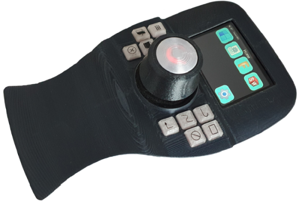
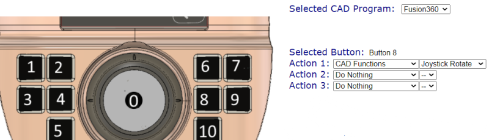

# CADDeck

Dies ist ein kombiniertes Joystick- und Touch-Panel-Display, das für die Verwendung mit gängigen CAD-Programmen geeignet ist. Es enthält:
1. Zwei-Achsen-Joystick (z. B. für X-, Y-Pan)
2. Hallsensor im Joystick Drehknopf (z. B. für Zoom) mit Drucksensor (z. B. Bewegung des Bauteils in Verbindung mit dem Joystick)
3. Im Knopf befindet sich ein zweiter Hallsensor. Mit einer leichten Drehung nach rechts oder links können Sie das Bauteil drehen.
4. Zehn Schalter um die Basis herum (z. B. Messen, ESC ...)
5. LCD-Touchpanel mit bis zu 10 Bildschirmen mit 12 Tasten

Alle H/W-Tasten sowie die Touch-Panel-Tasten sind über eine Webseite programmierbar.

Es verbindet sich über Bluetooth mit der HID-Schnittstelle mit dem PC (dh es sieht für den PC aus wie eine Tastatur und eine Maus). Ein USB-C-Anschluss ist für die Stromversorgung und zum Herunterladen von Code vorgesehen. Die Position des USB-C-Anschlusses auf der linken Seite ist nicht ideal, aber dort befindet er sich auf dem verwendeten Bildschirm. Es sollte möglich sein, das Gerät mit Strom zu versorgen und es fest mit dem Bildschirm zu verdrahten, anstatt USB-C für die Stromversorgung zu verwenden, aber ich habe dies nicht versucht.

## Touch-Panel
Das Touchpanel ist aus dem FreeTouchDeck-Projekt von Dustin Watt (https://github.com/DustinWatts/FreeTouchDeck.git) adaptiert, das ich modifiziert habe, um die Anzahl der Tasten usw. zu erhöhen (https://github.com/andrewfernie/FreeTouchDeckWT32.git ). Für dieses Projekt habe ich Unterstützung für Joystick, Encoder und Tasten hinzugefügt. Am einfachsten geht es mit einem WT32-SC01 Board (http://www.wireless-tag.com/portfolio/wt32-sc01/). Kaufen Sie das Basisboard, nicht die "Plus"-Version, da das Plus eine parallele Schnittstelle zum LCD-Panel verwendet und nicht genügend IO-Leitungen für den Joystick und die Tasten usw. frei lässt. Das Board enthält ein ESP32-Modul und ein 3,5-Zoll-Modul. LCD mit kapazitivem Touchscreen.

## S/W-Build-Hinweise:
1. Der Build verwendet die PlatformIO-IDE für VSCode. Installieren Sie VSCode, dann das PlatformIO-Plugin und Sie sollten loslegen.
2. Sie müssen sicherstellen, dass die entsprechenden Pins für Ihre Hardwarekonfiguration definiert sind. Ich habe meine für den WT32-SC01 gebaut und den Code für ein handverdrahtetes ESP32-Modul + resistiven Touchscreen erstellt.
3. Möglicherweise sehen Sie Build-Meldungen wie
 
In der Datei enthalten von include/CADDeck.h:14,
aus include/SaveConfig.h:3,
aus src/SaveConfig.cpp:1:
.pio/libdeps/esp-wrover-kit/TFT_eSPI/TFT_eSPI.h:909:8: Warnung: #warning >>>>------>> TOUCH_CS-Pin nicht definiert, TFT_eSPI-Touchfunktionen sind nicht verfügbar! [-Wcpp]
#warning >>>>------>> TOUCH_CS-Pin nicht definiert, TFT_eSPI-Touch-Funktionen sind nicht verfügbar!`
 
Sie können diese loswerden, indem Sie TOUCH_CS in der platformio.ini für jeden unbenutzten Pin definieren, der ein gültiger Ausgangspin ist. Die Alternative besteht darin, TOUCH_CS nicht zu definieren (die Zeile zu löschen oder ein Semikolon davor zu setzen) und die Meldungen einfach zu ignorieren.

#define TOUCH_CS=33

4. Das System versucht beim Start das Logo in "CADDeck_logo.bmp" anzuzeigen. Wenn nichts angezeigt werden soll, vergewissern Sie sich, dass die Datei nicht existiert. In diesem Fall sehen Sie eine Meldung wie die folgende auf der seriellen Schnittstelle. Solange Sie nichts beim Start angezeigt haben, ignorieren Sie die Meldung.
 
[ 1159][E][vfs_api.cpp:104] open(): /littlefs/logos/CADDeck_logo.bmp existiert nicht, keine Erlaubnis zur Erstellung

5. Möglicherweise sehen Sie einige Fehlermeldungen wie
 
[vfs_api.cpp:104] open(): /littlefs/list existiert nicht
 
Dies ist ein bekanntes Problem mit ESPAsyncWebsServer im Zusammenhang mit LittleFS, das Ordner unterstützt, während SPIFFS dies nicht tut. Siehe https://github.com/lorol/

6. Probleme? Es gibt einige Debug-Meldungen, die in FreeTouchDeck.h aktiviert werden können
 
#define LOG_MSG_BASIC 1
#define LOG_MSG_LEVEL 1 // 1=FEHLER, 2=FEHLER+WARNUNG, 3=FEHLER+WARNUNG+INFO
#define LOG_MSG_DEBUG 0
#define LOG_MSG_TOUCH_DEBUG 0 // Nachrichten an die Konsole jedes Mal, wenn eine Berührung erkannt wird

Versuchen Sie, LOG_MSG_LEVEL auf 3 einzustellen, und Sie erhalten einige weitere Statusmeldungen

# Hardware-Build

Die meiste Montage ist einfach und besteht hauptsächlich aus Verkabelung. Vollständige 3D-CAD-Modelle werden sowohl im Fusion360- als auch im STEP-Format im Hardware-/Modellordner bereitgestellt.

Verweise auf Tastennummern sind in diesem Diagramm dargestellt:

## Fall
Ein Fusion360-Modell des Gehäuses und STL-Dateien sind im CADDeck-Repository enthalten. Der Hauptteil ist zweiteilig gedruckt.
Das Oberteil wird mit 6 Stücke M3-Kopfschrauben von unten verschraubt. Im Oberteil kommen M3 Gewindeeinsätze zum Einsatz (sechs Positionen),
Dann wird der Boden mit M3-Flachkopfschrauben an der Oberseite befestigt.

## Display Einbauen
Es gibt keine offensichtliche Möglichkeit, den Bildschirm am Gehäuse zu befestigen, also habe ich ihn mit festen Abstandshaltern auf der Rückseite und zwei einsteckbaren Abstandshaltern auf der Vorderseite befestigt, die erst eingesetzt werden, wenn das Display und die TPU-Dichtung in das Gehäuse eingesetzt wurden.
Bei Bedarf kann er auch mit zwei Schrauben gegen die TPU-Dichtung gedrückt werden. Bei mir war es nicht nötig.

Die USB-C Adapterplatine wird mit zwei Blechschrauben auf dem kleinen Sockel befestigt.

4 x M3 Flachkopfschrauben kommen durch den Boden des Gehäuses und werden verwendet, um sowohl den Joystick als auch die Schalterplatte mit den 10 Schaltern zu befestigen.

## Joystick-Knopf

Der knifflige Teil ist der Joystick-Knopf und insbesondere die Magnete und Hallsensoren. Der obere Hallsensor wird direkt eingeklebt und den unteren habe ich vorher auf ein kleines Lochblech gelötet und dann mit Sekundenkleber befestigt, eventuell werden wir versuchen eine Platinen-Layout dafür zu erstellen, ebendso für die MX-Taster.

Ich habe an den Kabeln Stecker angebracht, sowohl für die Joystickknopf, den Joystick, die 10 Tasten und die Verbindungen zwischen dem Display und dem PCF 8575.

Der Joystickknopf besteht aus mehreren 3D-gedruckten Teilen.
Im Inneren des Joystickknopfes befinden sich mehrere Magnete, die sich gegenseitig abstoßen und ihn in einer schwebenden Position halten. Ich habe ein wenig Sekundenkleber verwendet, um die Magnete zu befestigen, dazu kann man einfach einen Tropfen Sekundenkleber durch die kleine Bohrung im Kunststoff laufen lassen.
Im Bildverzeichnis finden Sie eine Darstellung wie die Magnete (N+S) angeordnet sind.

Wenn alle Magnete montiert sind, werde das Kreuz und der Magnethalter vorsichtig zusammengesteckt und dann so verdreht, dass die Magnete übereinander liegen. 
Dann werden die drei Führungsstifte mit etwas Fett eingesetzt, sie halten die beiden Teile zusammen.
Ein M4x16mm Abstandshalter aus Messing wird von oben in den die Grundplatte gedrückt (ggf. mit etwas Kleber fixieren).
Dann die Grundplatte mit etwas Fett von unten in die das Kreuz einführen und darauf acht, das es schön leichtgängig ist.
Eventuell muss die Achse etwas bearbeitet werden, je nachdem wie genau ihr Drucker druckt.
Ich habe ein M4 Schraube in die Grundplatte geschraubt, diese in einen Akkuschrauber gespannt und mit Schmirgelpapier so lange bearbeitet,
bis es passte.
Die untere Platte mit den Magneten wird mit drei selbstschneidenden Schrauben befestigt.
Der Berührungssensor wird mit Klebstoff im Deckel befestigt, der Deckel wird erst ganz zum Schluss oben in das Rad gedrückt und sollte ohne Klebstoff halten.
Die Kabel vom Berührungssensor und den oberen Hallsensor werden durch Löcher nach unten geführt. Lassen Sie die Kabel bitte etwas länger, da der Joystickknopf später auf den Joystick gedreht wird.

Auf der Schalterkonsole werde alle 10 MX-Taster eingesetzt und gemäß Schaltplan verdrahtet.
Der PCF8575 wird mit Blechschrauben auf der Adapterplatte befestigt.
Erst den Joystick von unten einsetzen, dann die Adapterplatte und dann die Schalterkonsole.
Von oben den Schaumstoff einlegen, dann Joystickknopf auf den Joystick drehen und die Kabel unter den Schaumsoff nach unten führen.
Der Joystickknopf wird am Joystick befestigt und von oben mit einer M4 Stiftschraube gekontert, so dass er fest auf der Joystickachse sitzt.
Nun wird das Gehäuse zusammengesetzt. Erst alle Schrauben von unten los eindrehen. Dann die Sechs äußeren Schrauben festziehen.
Die Schalterkonsole nun so ausrichten, dass die Schalterkappen nicht klemmen und zum Schluss die vier letzten Schrauben anziehen.

## Verkabelung
Ein [Schaltplan](hardware/Electrical/Wiring%20Diagram.pdf) ist im Ordner hardware/electrical enthalten. Das meiste davon ist einfach.

## Liste der Einzelteile
Menge 1 [ESP32-SC01 LCD-Touchscreen] (https://www.aliexpress.com/item/1005004399769442.html)

Menge 1 [2mm 2x20 Stiftleiste](https://www.aliexpress.com/item/1005001852671581.html)

Menge 1 [TTP223 Kapazitiver Touch-Schalter](https://de.aliexpress.com/i/33012282190.html)

Menge 10 [Cherry MX Taster](https://www.ebay.de/itm/183967039197) (Diese gibt es in verschiedenen Ausführungen. Mit oder ohne Klick, schwerer oder leichter Widerstand.)

Menge  1 [FrSky M9 Joystick] (https://www.aliexpress.com/item/32829691785.html) Dieser ist ein bisschen teuer, aber es ist ein Gerät von guter Qualität.
         Nichts Besonderes in Bezug auf die Funktionalität - Sie brauchen nur etwas mit analogen X- und Y-Ausgängen.

Menge  1 [PCF8575 I2C IO Expander] (https://www.aliexpress.com/item/1005004433286881.html)

Menge  1 [USB-C Adapterplatine] (https://de.aliexpress.com/item/1005003446036071.html)

Menge  2 [Hallsensoren 49E](https://de.aliexpress.com/item/1903819684.html)

Menge 40 [Auswucht-Klebegewichte](https://www.ebay.de/itm/363221786745) (Falls nötig. Der Koffer war mir zu leicht, als ich den Knopf nach oben zog.
          Man kann aber auch was anderes nehmen um das Gewicht zu erhöhen.)

Menge 10 10k 1/8W Durchsteckwiderstände Cherry MX Taster

Menge  6 M3 Messingeinsätze (für das Gehäuseoberteil)

Menge  3 M2 Messingeinsätze (für den Joystick-Knopf um das Rad zu befestigen)

Menge  3 Blechschraube 2,2x5mm (für Magnethalter unten)

Menge 11 Neodym-Magnet N52 5x5x1mm (9 Stück für die Drehbewegung und zwei Stück übereinander für den Hallsensor)

Menge  6 Neodym-Magnet N52 8x1mm (im Joystickknopf oben und unten)

Menge  3 Neodym-Magnet N52 8x3mm (im Joystick-Knopf in der Mitte)

Menge 10 Schrauben M3x16mm (für das Gehäuse und zur Befestigung des Joysticks)

Menge  9 Schrauben M2x5mm  (um das Rad auf dem Joystick-Knopf, die USB-C Platine zu befestigen und den PCF8575 zu befestigen)

JST RM 2,54mm Steckverbinder 5polig.

JST RM 2,54mm Steckverbinder 2polig.

Dupont Steckverbinder RM 2,54mm

Etwas weichen Schaumstoff (zwischen Joystickknopf und Joystick)

26 AWG Silikonlitze (0,14mm²) (am besten in mehreren Farben um Verwechslung zu vermeiden)

# Aufstellen
Sobald das Gerät zusammengebaut ist und das Display erscheint, sollten Sie die Hauptseite sehen.

Gehen Sie zur Seite CAD-Einstellungen.

Dann die Switch-Monitor-Seite.

Es zeigt den Status von Joystick, Encoder und Tasten an. Sie sollten das Ergebnis jeder Joystick-Bewegung oder Tastenauswahl sehen können. Beachten Sie, dass die Werte als 1 angezeigt werden, wenn sie nicht ausgewählt sind, und als 0, wenn sie ausgewählt (gedrückt) sind.

Die X- und Y-Daten des Joysticks springen möglicherweise etwas herum. Dies ist normal, da der Joystick zu diesem Zeitpunkt noch nicht kalibriert ist.

So kalibrieren Sie den Joystick:
1. Gehen Sie zurück zur Seite CAD-Einstellungen
2. Drücken Sie die Joystick Zero-Taste, wenn der Joystick zentriert und ruhig ist. Damit wird der Nullpunkt für den Joystick eingestellt.
3. Drücken Sie die Joystick Scale-Taste und bewegen Sie den Joystick zu den Extremen in X und Y. Sie haben 5s. Sobald die Funktion beendet ist,
   werden die Kalibrierungsparameter berechnet und der Joystick sollte sowohl in X als auch in Y einen Bereich von ungefähr +/- 1 anzeigen.
4. Wenn Sie mit der Kalibrierung zufrieden sind, klicken Sie auf die Schaltfläche CAD-Konfiguration speichern und die Parameter werden
   in der Datei caparams.json im ESP32 gespeichert. Diese Datei kann über die Seite CAD-Einstellungen im Konfigurator vom ESP32 auf Ihren PC heruntergeladen werden.
   Es ist eine gute Idee, dies zu tun und die Datei in den Ordner data\config im CADDeck-Code zu kopieren, damit Sie die Parameter nicht verlieren,
   wenn Sie den Datenordner das nächste Mal auf den ESP32 hochladen.
4. Wenn Sie mit den Ergebnissen nicht zufrieden sind, versuchen Sie es erneut.

Binden Sie Ihren Computer über die Bluetooth-Einstellungsseite auf Ihrem Computer an das CADDeck.

# Aufbau
Beachten Sie, dass es sich bei allen oben gezeigten oder erwähnten Seiten um Muster handelt.
Über den Konfigurator lässt sich jede Seite neu organisieren und an Ihre Bedürfnisse anpassen.

## WLAN-Konfiguration
Der Zugriff auf den Konfigurator erfolgt über einen Webbrowser auf einem Computer oder Tablet, das mit demselben Netzwerk wie der ESP32 verbunden ist.
Um den Konfigurator zu aktivieren, gehen Sie zur Einstellungsseite auf dem Touchpanel und wählen Sie die Schaltfläche WLAN aktivieren.

Wenn Sie Ihre WLAN-Verbindung bereits in wificonfig.json konfiguriert haben, sollten Sie eine Meldung sehen, die besagt, dass sie mit dem WLAN verbunden ist
und die IP-Adresse anzeigt. An diesem Punkt können Sie zu Ihrem Browser gehen und die IP-Adresse oben eingeben. Der Konfigurator wird angezeigt.

Wenn Sie das WLAN noch nicht konfiguriert haben, sollte eine Meldung angezeigt werden, die besagt, dass ein Zugangspunkt (AP) mit einem Netzwerknamen
und einer IP-Adresse erstellt wurde. Sie müssen Ihren Computer mit dem bereitgestellten Netzwerk verbinden und dann Ihren Browser auf die IP-Adresse verweisen.
Sobald der Konfigurator-Bildschirm in Ihrem Browser angezeigt wird, gehen Sie zur WLAN-Seite und geben Sie Ihre Netzwerk-SSID und Ihr Passwort ein.
Wählen Sie dann „Save WiFi Config“, um die Einstellungen zu speichern.

## Menükonfiguration
Die Hauptänderung gegenüber dem ursprünglichen FreeTouchDeck besteht darin, mehr Schaltflächen pro Seite zuzulassen - die Bildschirmfläche ist nur ein bisschen kleiner
als die Größe von zwölf StreamDeck-Schaltflächen, was vernünftig erscheint. Der Code ist derzeit auf drei Reihen mit vier Schaltflächen eingestellt,
kann aber auf drei Reihen mit fünf Schaltflächen (oder zwei Reihen mit vier usw.) geändert werden,
indem CADDeck.h geändert wird: „#define BUTTON_ROWS 3“ und „#define BUTTON_COLS 5“. ". Im Prinzip sollte es größere Arrays unterstützen, aber nicht getestet,
und die Konfiguratorseite ist auf maximal 3x5 eingestellt.

Der Konfigurator zeigt eine Reihe von drei Reihen mit fünf Schaltflächen mit einer Dropdown-Liste zur Auswahl der zu ändernden Menüseite an.
Wenn Sie weniger als 3x5 verwenden, ignorieren Sie einfach die zusätzlichen Zeilen und Spalten. Auf der To-do-Liste steht die dynamische Generierung des HTML
entsprechend der Anzahl der Zeilen und Spalten.

Jede Menüseite hat ein 2D-Array von programmierbaren Tasten, und jede Taste hat eine Reihe von 3 Aktionen, die definiert werden können, wenn die Taste gedrückt wird.

Sie können verschiedene Hintergrundfarben für eine Schaltfläche festlegen, die eine Aktion ausführt (schwarzer Hintergrund im Bild oben)
oder Links zu einem anderen Menü (hellblau im Bild). Dies wird auf der Seite Einstellungen des Konfigurators gesteuert.

Wenn Sie nicht alle Schaltflächen verwenden möchten, verwenden Sie den Konfigurator, um das Logo auf "blank.bmp" einzustellen, und stellen Sie sicher,
dass für diese Schaltfläche keine Aktionen definiert sind. Schaltflächen mit diesen Eigenschaften werden nicht gezeichnet.

Eine Einschränkung ist die Größe des FLASH-Speichers, der für die auf dem Touchscreen angezeigten Konfigurationsdateien und Symbole verwendet wird.
Die Symbole sind 75 x 75 24-Bit-Farb-BMP-Dateien, die jeweils etwa 17 kB benötigen. Wenn Ihnen der Speicherplatz ausgeht, besteht Ihre einzige Möglichkeit darin,
zu prüfen, ob welche unbenutzt sind und sie zu löschen.

## Hardwaretasten
Die Konfiguration der Hardwaretasten erfolgt über eine spezielle Seite innerhalb desselben webbasierten Konfigurators wie für das LCD-Panel.

Der obere Abschnitt enthält:
1. Aktuelles CAD-Programm: Dies ist das Programm, dessen Einstellungen geladen werden, wenn das CADDeck neu gestartet wird
2. X- und Y-Skalierungsparameter für den Joystick. Diese können manuell eingestellt werden, es wird jedoch eine Funktion bereitgestellt, um Daten zu erfassen,
   wenn der Joystick bis  zu seinen Extremen bewegt wird, und die Skalierungen für Sie zu berechnen. Die Ausgangsskalierung beträgt +/-1
3. Totzone des Joysticks. Jeder X- oder Y-Wert mit einem Absolutwert unterhalb dieser Zahl wird auf Null gesetzt.
4. Joystick-Empfindlichkeit. Joystick-Werte werden damit multipliziert, wenn sie in Mausbewegungsbefehle umgewandelt werden
5. Daumenrad-Empfindlichkeit. Der Encoderwert wird damit multipliziert, wenn er in Mausbewegungsbefehle umgewandelt wird
6. Stabile Zeit: Nachdem der Joystick länger als diese Zeit zentriert war, ohne dass eine Schaltfläche zum Schwenken oder Drehen ausgewählt wurde,
   kehrt der Joystick in seinen Standardmodus zurück (normalerweise Mauszeiger).

Darunter befindet sich die Schaltflächenaktionsdefinition. Der gleiche Ansatz zur Definition der Aktionen wird verwendet wie für die Tasten des LCD-Bedienfelds.
Die Aktionen sind:
1. Ausgewähltes CAD-Programm. Das Programm, dessen Einstellungen in diesem Teil des Konfigurators geändert werden.
   Für jedes der fünf verfügbaren CAD-Programme werden separate  Definitionen dieser Einstellungen gespeichert.
2. Ausgewählte Schaltfläche. Einer der neun Knöpfe, die im Bild links gezeigt werden.
   Klicken Sie auf einen der angezeigten Bereiche im Bild und ändern Sie dann die Aktionen für diese Schaltfläche nach Bedarf.
3. Die Aktionen, die unternommen werden müssen, damit das Schwenken/Drehen/Zoomen durch den Joystick (dh die Maus) innerhalb des ausgewählten CAD-Programms gesteuert werden kann.
   Beachten Sie, dass die Definition dessen, was zum Steuern des Schwenkens/Drehens/Zoomens erforderlich ist, unabhängig davon ist, welche Schaltfläche diesen Modus aktiviert.
   Beispielsweise benötigt Solidworks die mittlere Maustaste, um die Ansicht zu drehen. JoystickRotate/Action1 ist also auf „Mouse Buttons“ und Value1 auf „Press Middle Button“ eingestellt. Um die Rotate-Funktion der Taste 8 zuzuweisen, klicken Sie im Bild links auf „8“,
   setzen Sie dann SelectedButton/Action1 auf „CAD Functions“ und Value1 auf „Joystick Rotate“.

Ganz unten befindet sich die Schaltfläche "CAD-Konfiguration speichern".
Bei Auswahl werden die Einstellungen für alle CAD-Programme auf dem ESP32 in der Datei caparams.json gespeichert

## Standardkonfiguration
Während alles über den Konfigurator geändert werden kann, gibt es einige Standardeinstellungen, die mit dem Code bereitgestellt werden.
Diese sind:

### Kontrollzuweisungen
1. Joystick bewegt den Mauszeiger
2. Joystick mit gedrückter Taste 0 schwenkt die Ansicht
3. Joystick drehen dreht die Ansicht
4. Drücken Sie den Joystick nach unten oder ziehen Sie ihn nach oben, um die Ansicht zu vergrößern.
5. Schaltfläche 1 ist Messen ("i" in Fusion360) (Ich habe "i" als Tastenkombination zum Messen in Solidworks zugewiesen)
6. Taste 2 stellt den Zoom passend ein ("F6" in Fusion360), ("f" in Solidworks)
7. Taste 3 deaktiviert ("ESC" in Fusion360 und Solidworks)
8. Schaltfläche 4 schaltet die Objektsichtbarkeit um ("v" in Fusion360) oder blendet das Objekt aus ("TAB" in Solidworks)

### Menüs
Menünummern werden wie folgt vergeben:
 1. Menü 0: Hauptmenü
 2. Menü 1: Systemeinstellungen
 3. Menü 2: CAD-Einstellungen
 4. Menü 3: Nicht verwendet
 5. Menü 4: Nicht verwendet
 6. Menü 5: Nicht verwendet
 7. Menü 6: Nicht verwendet
 8. Menü 7: Aktives CAD-Programm auswählen
 9. Menü 8: Fusion360-Aktionen
10. Menü 9: Nicht verwendet
 

