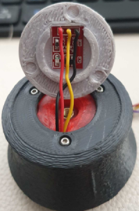
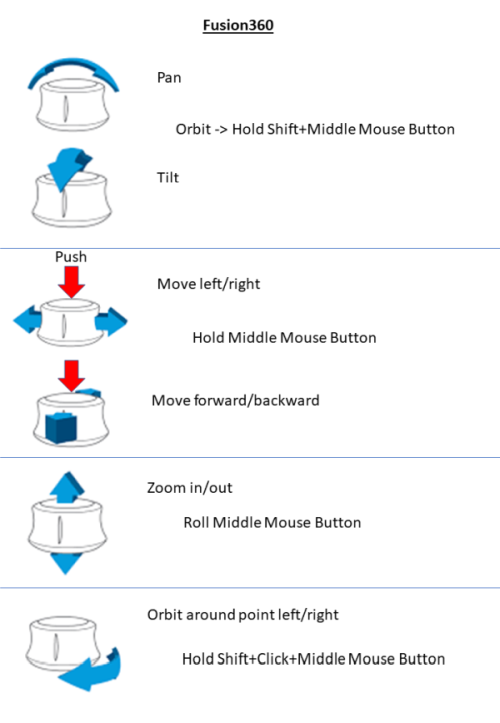

# CADdeck

This is a combined joystick and touch panel display suitable for use with popular CAD programs. It contains:
1. Two-axis joystick (e.g. for X, Y pan)
2. Hall sensor in the joystick Rotary knob (e.g. for zoom) with pressure sensor (e.g. movement of the component in connection with the joystick)
3. There is a second Hall sensor in the knob. With a slight turn to the right or left you can rotate the component.
4. Ten switches around the base (e.g. measure, ESC...)
5. LCD touch panel up to 10 screens with 12 keys

All H/W keys and the touch panel keys are programmable via a web page.

It connects to the PC via Bluetooth using the HID interface (i.e. it looks like a keyboard and mouse to the PC). A USB-C port is provided for power and code downloading. The USB-C port's left-side location isn't ideal, but that's where it's located on the screen being used. It should be possible to power the device and hardwire it to the screen instead of using USB-C for power, but I haven't tried this.

## Touch panel
The touch panel is adapted from Dustin Watt's FreeTouchDeck project (https://github.com/DustinWatts/FreeTouchDeck.git), which I modified to increase the number of buttons etc. (https://github.com /andrewfernie/FreeTouchDeckWT32.git ). For this project I added joystick, encoder and button support. The easiest way is with a WT32-SC01 board (http://www.wireless-tag.com/portfolio/wt32-sc01/). Buy the base board, not the "Plus" version, as the Plus uses a parallel interface to the LCD panel and doesn't leave enough IO lines free for the joystick and buttons etc. The board contains an ESP32 module and a 3.5 inch module. LCD with capacitive touch screen.

## S/W Build Notes:
1. The build uses the PlatformIO IDE for VSCode. Install VSCode, then the PlatformIO plugin and you should be good to go.
2. You must ensure that the appropriate pins are defined for your hardware configuration. I built mine for the WT32-SC01 and created the code for a hand wired ESP32 module + resistive touchscreen.
3. You may see build messages like
 
Contained in the file by include/CADDeck.h:14,
from include/SaveConfig.h:3,
from src/SaveConfig.cpp:1:
.pio/libdeps/esp-wrover-kit/TFT_eSPI/TFT_eSPI.h:909:8: Warning: #warning >>>>------>> TOUCH_CS pin not defined, TFT_eSPI touch functions are not available! [-Wcpp]
#warning >>>>------>> TOUCH_CS pin not defined, TFT_eSPI touch functions are not available!`
 
You can get rid of these by defining TOUCH_CS in platformio.ini for each unused pin that is a valid output pin. The alternative is to not define TOUCH_CS (delete the line or put a semicolon in front of it) and just ignore the messages.

#define TOUCH_CS=33

4. The system tries to display the logo in "CADDeck_logo.bmp" at startup. If you don't want anything to appear, make sure the file doesn't exist. In this case you will see a message like the following on the serial port. As long as you didn't see anything at startup, ignore the message.
 
[ 1159][E][vfs_api.cpp:104] open(): /littlefs/logos/CADDeck_logo.bmp does not exist, no permission to create

5. You may see some error messages like
 
[vfs_api.cpp:104] open(): /littlefs/list does not exist
 
This is a known issue with ESPAsyncWebsServer related to LittleFS supporting folders while SPIFFS does not. See https://github.com/lorol/

6. Problems? There are some debug messages that can be enabled in FreeTouchDeck.h
 
#define LOG_MSG_BASIC 1
#define LOG_MSG_LEVEL 1 // 1=ERROR, 2=ERROR+WARNING, 3=ERROR+WARNING+INFO
#define LOG_MSG_DEBUG 0
#define LOG_MSG_TOUCH_DEBUG 0 // Messages to the console each time a touch is detected

Try setting LOG_MSG_LEVEL to 3 and you'll get some more status messages

# Hardware build

Most assembly is simple and consists primarily of wiring. Complete 3D CAD models are provided in both Fusion360 and STEP format in the hardware/models folder.

References to button numbers are shown in this diagram:

## case
A Fusion360 model of the case and STL files are included in the CADDeck repository. The main part is printed in two parts.
The upper part is screwed on from below with 6 pieces of M3 head screws. M3 thread inserts are used in the upper part (six positions),
Then the bottom is attached to the top with M3 pan head screws.

## Install the display
There is no obvious way to attach the screen to the case, so I attached it with fixed standoffs on the back and two snap-in standoffs on the front that only go in place once the display and TPU gasket have been placed into the case .
If necessary, it can also be pressed against the TPU seal with two screws. For me it wasn't necessary.

The USB-C adapter board is attached to the small base with two self-tapping screws.

4 x M3 pan head screws come through the bottom of the case and are used to attach both the joystick and the switch plate with the 10 switches.

## Joystick button

The tricky part is the joystick button and in particular the magnets and hall sensors. The upper Hall sensor is glued in directly and I soldered the lower one to a small perforated plate beforehand and then attached it with superglue. We may try to create a circuit board layout for it, as well as for the MX buttons.

I attached connectors to the cables for both the joystick button, the joystick, the 10 buttons and the connections between the display and the PCF 8575.

The joystick button consists of several 3D printed parts.
Inside the joystick button are several magnets that repel each other and keep it in a floating position. I used a little superglue to attach the magnets, you can just run a drop of superglue through the small hole in the plastic.
In the picture directory you will find a representation of how the magnets (N+S) are arranged.

When all magnets are mounted, the cross and the magnet holder are carefully put together and then twisted so that the magnets are on top of each other.
Then the three guide pins are inserted with some grease, they hold the two parts together.
An M4x16mm spacer made of brass is pressed into the base plate from above (fix with some glue if necessary).
Then insert the base plate with a little grease from below into the cross and make sure that it runs smoothly.
The axis may need some editing, depending on how accurate your printer prints.
I screwed an M4 screw into the base plate, clamped it in a cordless screwdriver and sandpapered it until
until it fits.
The bottom plate with the magnets is attached with three self-tapping screws.
The touch sensor is attached to the lid with glue, the lid is pushed into the top of the wheel at the very end and should hold without glue.

The wires from the touch sensor and the top hall sensor are routed down through holes. Please leave the cables a bit longer as the joystick knob will be rotated onto the joystick later.

All 10 MX buttons are used on the switch console and wired according to the circuit diagram.
The PCF8575 is attached to the adapter plate with self-tapping screws.
First insert the joystick from below, then the adapter plate and then the switch console.
Insert the foam from above, then turn the joystick knob onto the joystick and guide the cables down under the foam.
The joystick button is attached to the joystick and countered from above with an M4 stud screw so that it sits firmly on the joystick axis.
Now the housing is assembled. First screw in all the screws loosely from below. Then tighten the six outer screws.
Now align the switch console so that the switch caps do not jam and finally tighten the last four screws.

In the Images directory there are a few more illustrations of how I printed the support.

## wiring
A [Schematic](hardware/Electrical/Wiring%20Diagram.pdf) is included in the hardware/electrical folder. Most of it is easy.

## List of parts
Quantity 1 [ESP32-SC01 LCD Touch Screen] (https://www.aliexpress.com/item/1005004399769442.html)

Quantity 1 [2mm 2x20 Pin Header](https://www.aliexpress.com/item/1005001852671581.html)

Quantity 1 [TTP223 Capacitive Touch Switch](https://www.aliexpress.com/i/33012282190.html)

Lot of 10 [Cherry MX Button](https://www.ebay.de/itm/183967039197) (These come in different styles. With or without click, heavy or light resistance.)

Quantity 1 [FrSky M9 Joystick] (https://www.aliexpress.com/item/32829691785.html) This one is a bit expensive but it is a good quality device.
Nothing fancy in terms of functionality - you just need something with analog X and Y outputs.

Quantity 1 [PCF8575 I2C IO Expander] (https://www.aliexpress.com/item/1005004433286881.html)

Quantity 1 [USB-C Adapter Board] (https://www.aliexpress.com/item/1005003446036071.html)

Quantity 2 [Hall Sensors 49E](https://www.aliexpress.com/item/1903819684.html)

Quantity 40 [Adhesive Balance Weights](https://www.ebay.de/itm/363221786745) (If necessary. The case was too light for me when I pulled the knob up.
But you can also use something else to increase the weight.)

Lot of 10 10k 1/8W push-through resistors Cherry MX pushbutton

Quantity 6 M3 brass inserts (for the case top)

Quantity 3 M2 brass inserts (for the joystick button to attach the wheel)

Quantity 3 sheet metal screw 2.2x5mm (for magnet holder below)

Quantity 11 neodymium magnets N52 5x5x1mm (9 pieces for the rotary movement and two pieces on top of each other for the hall sensor)

Quantity 6 neodymium magnet N52 8x1mm (in the joystick button above and below)

Quantity 3 neodymium magnet N52 8x3mm (inside the joystick button in the middle)

Quantity 10 screws M3x16mm (for the housing and for attaching the joystick)

Quantity 9 screws M2x5mm (to fix the wheel on the joystick button, the USB-C board and fix the PCF8575)

JST RM 2.54mm connector 5-pin.

JST RM 2.54mm connector 2-pin.

Dupont connector RM 2.54mm

Some soft foam (between joystick button and joystick)

26 AWG silicone wire (0.14mm²) (preferably in several colors to avoid confusion)

# Set up
Once the device is assembled and the display appears, you should see the main page.

Go to the CAD Settings page.

Then the switch monitor page.

It shows the status of the joystick, encoder and buttons. You should be able to see the result of each joystick movement or button selection. Note that the values ​​are shown as 1 when unselected and 0 when selected (pressed).

The joystick X and Y data may jump around a bit. This is normal as the joystick has not yet been calibrated at this point.

To calibrate the joystick:
1. Go back to the CAD Settings page
2. Press the Joystick Zero button when the joystick is centered and steady. This sets the zero point for the joystick.
3. Press the Joystick Scale button and move the joystick to the extremes in X and Y. You have 5s. Once the function is finished,
the calibration parameters will be calculated and the joystick should show a range of approximately +/- 1 in both X and Y.
4. When you are happy with the calibration, click the Save CAD Configuration button and the parameters will be saved
stored in the caparams.json file in the ESP32. This file can be downloaded to your PC from the ESP32 via the CAD Settings page in the Configurator.
It's a good idea to do this and copy the file to the data\config folder in the CADDeck code so you don't lose the parameters,
next time you upload the data folder to the ESP32.
4. If you are not satisfied with the results, try again.

Bind your computer to the CADDeck using the Bluetooth settings page on your computer.

# Construction
Note that all pages shown or mentioned above are samples.
Each page can be reorganized and adapted to your needs using the configurator.

## WLAN configuration
The configurator is accessed via a web browser on a computer or tablet connected to the same network as the ESP32.
To activate the configurator, go to the settings page on the touch panel and select the Activate WiFi button.

If you've already configured your WiFi connection in wificonfig.json, you should see a message saying it's connected to WiFi
and displays the IP address. At this point you can go to your browser and enter the IP address above. The configurator is displayed.

If you haven't already configured the wireless network, you should see a message stating that an access point (AP) with a network name
and an IP address was created. You need to connect your computer to the provided network and then point your browser to the IP address.
Once the configurator screen appears in your browser, go to the WiFi page and enter your network SSID and password.
Then select “Save WiFi Config” to save the settings.

## Menu configuration
The main change from the original FreeTouchDeck is allowing more buttons per side - the screen real estate is just a bit smaller
than the size of twelve StreamDeck buttons, which seems reasonable. The code is currently set to three rows of four buttons,
but can be changed to three rows of five buttons (or two rows of four, etc.),
by changing CADDeck.h: "#define BUTTON_ROWS 3" and "#define BUTTON_COLS 5". ". In principle it should support larger arrays, but not tested,
and the configurator page is set to a maximum of 3x5.

The configurator will display a series of three rows of five buttons with a drop down list for selecting the menu page to change.
If you're using less than 3x5, just ignore the extra rows and columns. Dynamic HTML generation is on the to-do list
according to the number of rows and columns.

Each menu page has a 2D array of programmable buttons, and each button has a set of 3 actions that can be defined when the button is pressed.

You can set different background colors for a button that performs an action (black background in the image above)
or links to another menu (light blue in the image). This is controlled on the Settings page of the configurator.

If you don't want to use all buttons, use the configurator to set the logo to "blank.bmp" and make sure
that no actions are defined for this button. Buttons with these properties are not drawn.

One limitation is the amount of FLASH memory used for the configuration files and icons displayed on the touch screen.
The icons are 75 x 75 24-bit color BMP files, each taking up about 17kB. If you are running out of disk space, your only option is to
to check if any are unused and delete them.

## Hardware keys
The hardware buttons are configured via a dedicated page within the same web-based configurator as for the LCD panel.

The top section contains:
1. Current CAD program: This is the program whose settings will be loaded when CADDeck is restarted
2. X and Y scaling parameters for the joystick. These can be set manually, however a facility is provided to collect data
when the joystick is moved to its extremes, and calculate the scales for you. The output scaling is +/-1
3. Joystick dead zone. Any X or Y value with an absolute value below this number will be set to zero.
4. Joystick Sensitivity. Joystick values ​​are multiplied by this when converted to mouse movement commands
5. Thumbwheel Sensitivity. The encoder value is multiplied by this when converted to mouse movement commands
6. Stable Time: After the joystick has been centered for more than this time without a pan or rotate button selected,
the joystick returns to its default mode (usually mouse pointer).

Below that is the button action definition. The same approach to defining the actions is used as for the LCD panel buttons.
The actions are:
1. Selected CAD program. The program whose settings are changed in this part of the configurator.
Separate definitions of these settings are stored for each of the five available CAD programs.
2. Selected button. One of the nine buttons shown in the image to the left.
Click on one of the areas shown in the image, and then change the actions for that button as needed.
3. The actions that need to be taken in order for the pan/rotate/zoom to be controlled by the joystick (ie mouse) within the selected CAD program.
Note that the definition of what is required to control pan/rotate/zoom is independent of which button activates that mode.
For example, Solidworks needs the middle mouse button to rotate the view. So JoystickRotate/Action1 is set to "Mouse Buttons" and Value1 is set to "Press Middle Button". To assign the rotate function to key 8, click on "8" in the image on the left,
then set SelectedButton/Action1 to "CAD Functions" and Value1 to "Joystick Rotate".

At the very bottom is the "Save CAD Configuration" button.
When selected, the settings for all CAD programs on the ESP32 are saved in the caparams.json file

## Default configuration
While everything can be changed via the configurator, there are some default settings that are provided with the code.
These are:

### Control Assignments
1. Joystick moves the mouse pointer
2. Joystick with pressed button 0 pans the view
3. Rotate the joystick rotates the view
4. Push the joystick down or drag it up to zoom in.
5. Button 1 is Measure ("i" in Fusion360) (I assigned "i" as a shortcut to Measure in Solidworks)
6. Button 2 adjusts the zoom appropriately ("F6" in Fusion360), ("f" in Solidworks)
7. Button 3 disabled ("ESC" in Fusion360 and Solidworks)
8. Button 4 toggles object visibility ("v" in Fusion360) or hides ("TAB" in Solidworks) the object

### Menus
Menu numbers are assigned as follows:
1. Menu 0: Main menu
2. Menu 1: System settings
3. Menu 2: CAD settings
4. Menu 3: Not used
5. Menu 4: Not used
6. Menu 5: Not used
7. Menu 6: Not used
8. Menu 7: Select active CAD program
9. Menu 8: Fusion360 Actions
10. Menu 9: Not used
 

