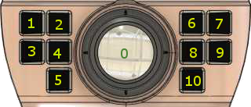
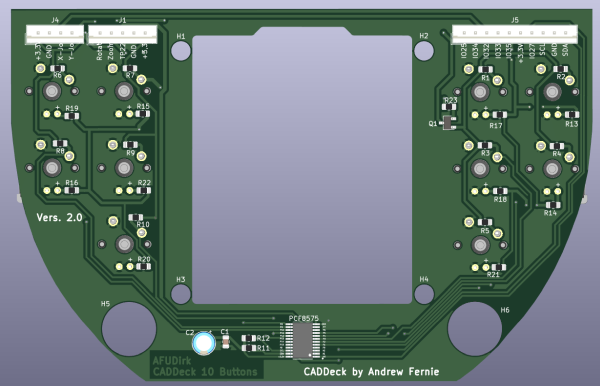
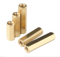
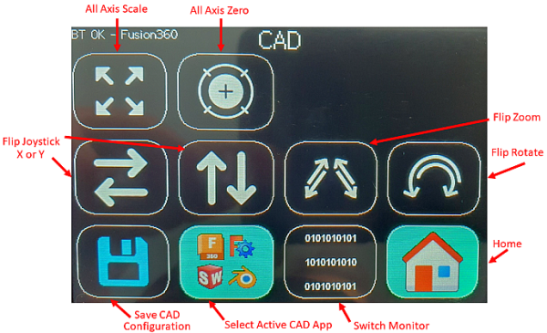
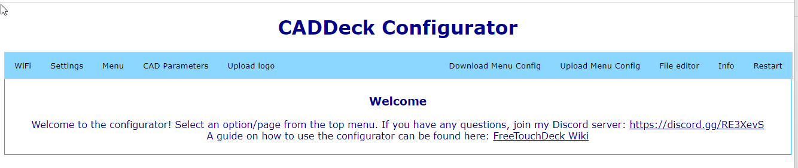

# CADdeck

This is a combined joystick and touch panel display that is suitable for use with common CAD programs. It contains:
1. Two-axis joystick (e.g. for X, Y pan)
2. Hall sensors in the joystick handle (e.g. for zoom and rotation) with a non-contact sensor (e.g. for moving the component in combination with the joystick)
3. Ten switches around the base (e.g. measure, ESC...)
4. LCD touch panel up to 10 screens with 12 keys

All H/W keys and the touch panel keys are programmable via a website.

The connection to the PC is via Bluetooth via the HID interface (ie to the PC it looks like a keyboard and mouse).
A USB-C port is available for power and code downloading.
The USB-C port on the back is for power to upload the code.
It should be possible to power the device and hard-wired it to the screen instead of using USB-C for power, but I haven't tried that.

Andrew added a USB interface with an RP2040 with which the CADDeck is 6DOF capable. We are still working on changing the code so
that only one processor is needed. At the moment a Bluetooth and a USB connection are required for the whole thing to work.

The firmware for the RP2040 is from https://github.com/jfedor2/magellan-spacemouse.
The version for the CADDeck can be found here: https://github.com/AFUDIrk/magellan-spacemouse

## Touch panel
The touch panel is inspired by Dustin Watt's FreeTouchDeck project (https://github.com/DustinWatts/FreeTouchDeck.git), which I modified to increase the number of buttons.
etc. (https://github.com/andrewfernie/FreeTouchDeckWT32.git). For this project I added joystick, Hallsensor and button support.
The easiest way to get this going is to use a WT32-SC01 card (http://www.wireless-tag.com/portfolio/wt32-sc01/).
Buy the base board, not the "Plus" version, as the Plus uses a parallel interface to the LCD panel and doesn't leave enough IO lines free for the joystick and buttons.
etc. The board contains an ESP32 module and a 3.5 inch LCD with a capacitive touchscreen.

## S/W Build Notes:
1. The build uses the PlatformIO IDE for VSCode. Install VSCode, then the PlatformIO plugin and you're good to go.
2. You must ensure that the appropriate pins are defined for your hardware configuration. I built mine for the WT32-SC01 and created the code for a hand wired ESP32 module + resistive touch screen.
3. You may see build messages like
 
In the file included from include/CADDeck.h:14,
from include/SaveConfig.h:3,
from src/SaveConfig.cpp:1:
.pio/libdeps/esp-wrover-kit/TFT_eSPI/TFT_eSPI.h:909:8: Warning: #warning >>>>------>> TOUCH_CS pin not defined, TFT_eSPI touch functions are not accessible! [-Wcpp]
#Warning >>>>------>> TOUCH_CS pin not defined, TFT_eSPI touch functions are not available!`
 
You can get rid of these by defining TOUCH_CS in platformio.ini for each unused pin that is a valid output pin.
The alternative is to not define TOUCH_CS (delete the line or add a semicolon in front of it) and just ignore the messages.

#define TOUCH_CS=33

4. The system will attempt to display the logo in CADDeck_logo.bmp on startup. If you don't want anything to show up, make sure the file doesn't exist. In this case, a message like the following is displayed on the serial interface.
As long as you didn't see anything at startup, ignore the message.
 
[ 1159][E][vfs_api.cpp:104] open(): /littlefs/logos/CADDeck_logo.bmp does not exist, no permissions to create

5. You may get error messages such as B. displayed
 
[vfs_api.cpp:104] open(): /littlefs/list does not exist
 
This is a known issue with ESPAsyncWebsServer related to LittleFS-backed folders, while SPIFFS is not. See https://github.com/lorol/

6. Having problems? There are some debug messages that can be enabled in FreeTouchDeck.h
 
#define LOG_MSG_BASIC 1
#define LOG_MSG_LEVEL 1 // 1=ERROR, 2=ERROR+WARN, 3=ERROR+WARN+INFO
#define LOG_MSG_DEBUG 0
#define LOG_MSG_TOUCH_DEBUG 0 // Messages to the console each time a touch is detected

Try setting LOG_MSG_LEVEL to 3 and you'll get some more status messages

# Hardware build

Most of the assembly is easy and mostly consists of the wiring.
Complete 3D CAD models are provided in both Fusion360 and STEP format in the hardware/model folder.

The references to button numbers are shown in this diagram:

## case
A Fusion360 model of the case and STL files are included in the CADDeck repository. The main case is printed in two parts.
The upper and lower part is screwed from below with M3 head screws.

There is no obvious way to attach the screen to the case. So I designed the case to hold the display with a frame.
First, the display is slid into the case until it snaps into the rear standoffs.
Then the TPU seal is pushed between the housing and the display and finally the two front spacers are inserted.
If necessary, the display can be pressed against the TPU seal from behind with two screws.
But wasn't necessary for me.

The USB-C adapter board is attached to the small base with two self-tapping screws.

6 x M3 pan head screws go through the bottom of the case and are used to hold the case closed.
4 x M3 pan head screws come through the bottom of the case and are used to attach both the joystick and the switch plate with the 10 switches.

## Joystick button

The tricky part is the joystick button and in particular the magnets and hall sensors. The upper Hall sensor is glued in directly
and the lower one I soldered to a small hole pattern circuit board beforehand and then attached it with superglue.
A circuit board layout is also provided to have this made.
I have already had circuit boards made for the 10 switches and for the button, this makes the structure cleaner and there is no need to wire the MX buttons.

![PCB] (images/Knopfplatine_oben.png) (images/Knopfplatine_unten.png) 

![PCB] (images/Schalterplatine_oben.png) (images/Schalterplatine_unten.png)

 

 
								   

The joystick button consists of several 3D printed parts.
Inside the joystick knob are several magnets that repel each other, keeping it in a floating position. I used a little super glue
to attach the magnets. You can just run a drop of superglue through the small hole in the plastic.
In the index of images you will find a representation of the arrangement of the magnets (N+S).

When all magnets are mounted, the cross and the magnet holder are carefully put together and then turned so that the magnets are on top of each other.
Then the three guide pins are inserted with a little grease, they hold the two parts together.
An M4x16mm spacer made of brass is pressed into the base plate from above (fix with some glue if necessary).
Then insert the base plate into the cross from below with a little grease and make sure it moves easily.
Depending on how accurate your printer is printing, the axis may need some editing.
I screwed an M4 screw into the base plate, clamped it in a cordless screwdriver and sanded it down until it fitted.
The bottom plate with the magnets is attached with three self-tapping screws.
The touch sensor is attached to the lid with glue, the lid is pushed into the wheel at the very end and should hold without glue.

The wires from the touch sensor and top hall sensor are routed down through holes.
Please leave the cables a little longer as the joystick knob will be twisted onto the joystick later.

All 10 MX buttons are used on the switching console and wired according to the circuit diagram.
The PCF8575 is attached to the adapter plate with self-tapping screws.
First insert the joystick from below, then the adapter plate and then the switch console.
Insert the foam from the top, then twist the joystick knob onto the joystick and route the cables down under the foam.
The joystick button is attached to the joystick and countered from above with an M4 stud screw so that it sits firmly on the joystick axis.
Now the case is assembled. First loosely screw in all the screws from below. Then tighten the six outer screws.
Now align the switch console so that the switch caps do not jam and finally tighten the last four screws.

In the picture directory there are a few more pictures of how I printed out the support.

## wiring
A [Wiring Diagram](hardware/Electrical/WiringDiagram10Buttons.pdf) is included in the hardware/electrical folder. Most of this is straightforward.

## List of parts
Quantity 1 [ESP32-SC01 LCD Touch Screen] (https://www.aliexpress.com/item/1005004399769442.html)

Quantity 1 [2mm 2x20 Pin Header](https://www.aliexpress.com/item/1005001852671581.html)

Quantity 1 [Capacitive Touch Switch TTP223](https://www.aliexpress.com/i/33012282190.html)

Quantity 10 [Cherry MX Button](https://www.ebay.de/itm/183967039197) (These come in different designs. With or without a click, strong or light resistance.)

Quantity 1 [FrSky M9 Joystick] (https://www.ebay.de/itm/374032459911) This device is a bit expensive but good quality.
Functionally, there's nothing fancy - you just need something with analog X and Y outputs.

Quantity 1 [PCF8575 I2C IO Expander] (https://www.aliexpress.com/item/1005004433286881.html)

Quantity 1 [USB-C Adapter Board] (https://www.aliexpress.com/item/1005003446036071.html)

Quantity 2 [Hall Sensors 49E](https://www.aliexpress.com/item/1903819684.html)

Quantity 40 [Adhesive Balance Weights](https://www.ebay.de/itm/363221786745) (If needed. When I pulled up the knob, the case was too light for me.
But you can also use something else to add weight.)

Quantity 10 10k 1/8W push through resistors Cherry MX push button

Quantity 6 M3 brass inserts (for case top)

Quantity 3 M2 brass inserts (for the joystick button to attach the wheel)

Quantity 3 self-tapping screws 2.2x5mm (for magnet holder below)

Quantity 11 neodymium magnets N52 5x5x1mm (9 pieces for the rotary movement and two pieces on top of each other for the hall sensor)

Quantity 6 neodymium magnet N52 8x1mm (in the joystick button above and below)

Quantity 3 neodymium magnet N52 8x3mm (inside the joystick button in the middle)

Quantity 6 screws M3x10mm (for the housing)

Quantity 4 screws M3x20mm (for attaching the joystick)

Quantity 9 screws M2x5mm (to attach the wheel to the joystick button, the USB-C board and to attach the PCF8575)

Quantity 1 M4x16mm hex standoff 

Quantity 1 JST RM 2,54 mm connector and pin header  5-pin

Quantity 1 JST RM 2.54mm male and female header 4 pin

Quantity 1 JST RM 2.54mm male and female header 10 pin

Slightly soft foam (between joystick button and joystick)

26 AWG (0.14mm²) silicone wire (preferably in multiple colors to avoid confusion)

# Set up
Once the device is assembled and the display appears, you should see the main page.

Go to the CAD Settings page.

Then the Switch Monitor page.

It shows the status of the joystick, Push-Sensor and buttons. You should be able to see the result of each joystick movement or button selection.
Note that the values ​​are shown as 1 when unselected and 0 when selected (pressed).

The joystick X and Y data and the rotate and zoom data may fluctuate slightly. This is normal as the joystick has not yet been calibrated at this point.
To calibrate the joystick and knob:
1. Go back to the CAD Settings page
2. Press the joystick zero button when the joystick is centered and stationary. This sets the zero point for the joystick and knob.
3. Press the joystick scale button and move the joystick to the extreme X and Y point, rotate the knob and push it up and down.
You have 5 seconds.
Once the function is complete, the calibration parameters will be calculated and all axes should show a range of approximately +/- 1 in both X and Y.
4. When you are satisfied with the calibration, click the "Save CAD Configuration" button and the parameters will be saved in the cadparams.json file in the ESP32.
This file can be downloaded to your PC from the ESP32 via the CAD Settings page in the Configurator.
It's a good idea to do this and copy the file to the data\config folder in the CADDeck code so you don't lose the parameters the next time you upload the data folder to the ESP32.
4. If you are not satisfied with the results, try again.

Connect your computer to CADDeck using your computer's Bluetooth settings page.

# Construction
Please note that all pages shown or mentioned above are examples. Each page can be reorganized and adapted to your needs via the configurator.

## WLAN configuration
The configurator is accessed via a web browser on a computer or tablet connected to the same network as the ESP32.
To activate the configurator, go to the settings page on the touch panel and select the "Activate WiFi" button.

If you have already configured your WiFi connection in wificonfig.json, you should see a message that the WiFi is connected and the IP address is displayed.
At this point you can go to your browser and enter the IP address of top connect. The configurator is displayed.

If you haven't already configured the WiFi, you should see a message that an access point (AP) has been created with a network name and IP address.
You need to connect your computer to the provided network and then point your browser to the IP address.
Once the configurator screen appears in your browser, go to the WiFi page and enter your network SSID and password. Then select “Save WiFi Config” to save the settings.

## Menu configuration
The main change from the original FreeTouchDeck is allowing more buttons per side - the screen real estate is only slightly smaller than the size of twelve StreamDeck buttons, which seems reasonable.
The code is currently set to three rows of four buttons, but can be changed to three rows of five buttons (or two rows of four, etc.) by changing CADDeck.h: "#define BUTTON_ROWS 3" and "#define BUTTON_COLS 5 “. ".
In principle it should support larger arrays, but has not been tested and the configurator page is set to a maximum of 3x5.

The configurator displays a series of three rows of five buttons, with a drop-down list for selecting the menu page to change.
If you're using less than 3x5, just ignore the extra rows and columns. On the to-do list is to dynamically generate the HTML to fit the number of rows and columns.

Each menu page has a 2D row of programmable buttons and each button has a row of 3 actions that can be defined when the button is pressed.

You can set different background colors for a button that performs an action (black background in the image above) or for links to another menu (light blue in the image).
This is controlled on the Settings page of the configurator.

If you don't want to use all buttons, set the logo to "blank.bmp" in the configurator and make sure that no actions are defined for this button.
Buttons with these properties are not drawn.

One limitation is the size of the FLASH used for the configuration files and icons displayed on the touch screen. The icons are 75x75 24-bit color BMP files.
Each takes about 17 KB. If you are running out of disk space, your only option is to check if there is any free disk space and delete it.

## Hardware keys
The hardware buttons are configured via a dedicated page within the same web-based configurator as for the LCD panel.

The top section includes:
1. Current CAD program: This is the program whose settings will be loaded when CADDeck is restarted
2. X and Y scaling parameters for the joystick and knob. These can be set manually
   However, there is a feature that collects data while the joystick is pushed all the way down and calculates the scale for you. The output scaling is +/-1
3. Joystick and Knob Deadzone. Any X or Y value with an absolute value below this number will be set to zero.
4. Joystick Sensitivity. Joystick values ​​are multiplied by this when converted to mouse movement commands
5. Knob sensitivity. The Knob value is multiplied by this while being converted to mouse movement commands
6. Steady Time: After the joystick has been centered for more than this amount of time without a pan or rotate button being selected, the joystick will revert to its default mode (usually mouse pointer).

Below that is the definition of the button action. The same approach is used to define the actions as for the buttons on the LCD panel. The actions are:
1. Selected CAD program. The program whose settings are changed in this part of the configurator. Separate definitions of these settings are maintained for each of the five available CAD programs.
2. Selected button. One of the nine buttons shown in the image on the left. Click on one of the specified areas in the image, and then change the actions for that button as needed.
3. The actions that need to be performed to allow the joystick (ie mouse) to control pan/rotate/zoom in the selected CAD program.
Note that the definition of what is required to control pan/rotate/zoom is independent of which button activates that mode.
For example, with Solidworks, the middle mouse button must be held down to rotate the view. Therefore, "JoystickRotate/Action1" is set to "Mouse Buttons" and "Value1" is set to "Press the middle button".
To assign the Rotate function to button 8, click 8 in the image on the left, then set SelectedButton/Action1 to CAD Functions and Value1 to Joystick Rotate.

At the bottom is the "Save CAD configuration" button. When selected, the settings for all CAD programs on the ESP32 are stored in the caparams.json file

## Default configuration
While everything can be changed via the configurator, there are some default settings that are provided with the code.
These are:

### Control assignments
 1. Joystick moves the component
 2. Joystick with pressed push sensor (0), moves the component
 3. Rotating the joystick knob rotates the view
 4. Pushing or pulling the joystick button zooms in and out
 5. Button 1 is Model Toolbar ("S" in Fusion360)
 6. Button 2 is Fillet ("F" in Fusion360)
 7. Button 3 is Push Pull ("Q" in Fusion360)
 8. Button 4 is Extrude ("E" in Fusion360)
 9. Button 5 deselects ("ESC" in Fusion360 and Solidworks)
10. Button 6 is Line ("L" in Fusion360)
11. Button 7 is a rectangle with two dots ("R" in Fusion360)
12. Button 8 is Spline (I set it to "W" in Fusion360)
13. Button 9 is circle ("C" in Fusion360)
14. Button 10 is line ("Return" in Fusion360)

### Menus
Menu numbers are assigned as follows:
1. Menu 0: Main menu
2. Menu 1: System settings
3. Menu 2: CAD settings
4. Menu 3: Not used
5. Menu 4: Not used
6. Menu 5: Not used
7. Menu 6: Not used
8. Menu 7: Select active CAD program
9. Menu 8: Fusion360 Actions
10. Menu 9: Not used
 
If you need assistance with setup or sourcing the boards,
you can join my discord server.https://discord.gg/kFvPhqmc

